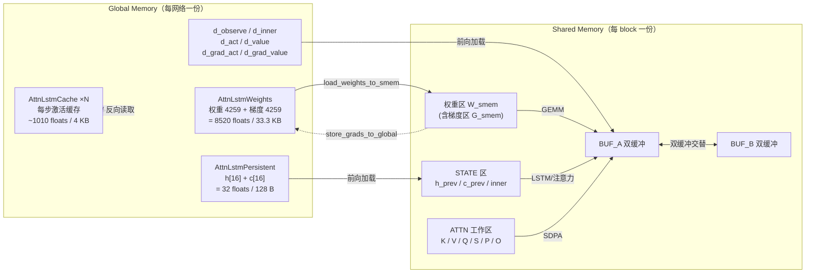

# AttnLSTM CUDA 实现

## 概述

AttnLSTM 是 ecoSim 强化学习智能体的"大脑"网络，采用单 block = 单网络、grid = 网络数的执行模型，在 CUDA 上手工实现前向 / 反向。网络结构为 **Actor（GQA 注意力 + LSTM）+ FCN Critic**。

**测试状态**：
- 前向：1–10 步全部通过（机器精度，act/value/h_new/c_new 全字段通过）
- 反向：
  - 单步：全部 15 个梯度字段通过（Critic 机器精度；Actor atol=8e-3 内，fp32 BPTT 累积误差）
  - 多步 BPTT 2 步：全部字段通过，Actor 精度（max_rel 1.17e-3）优于预期
  - 3 步起：预期 Critic + 输出层精确，Actor 梯度有累积误差
- 性能：RTX 2060 上 A2C 工作负载（10 fwd + 1 bwd with full BPTT）约 205 μs/网络/周期 @ 16384 网络

**最近修复**（2026-07-26 布局重构阶段2 验证）：
- Bug fix 1: 前向 act 被 Critic L2 覆写 → 在步骤8末尾立即写出 act
- Bug fix 2-4: 反向 actor_trigger 永假 + BPTT 窗口全量遍历 + 梯度槽位错误 → 新增 bptt_steps 参数、修正环形索引 `(step-1)%A2C`、添加 `set_grad_*_at_slot()`
- 详见 [Bug 修复记录](#bug-修复记录) 章节。

## 网络结构

### 全局数据流


### 权重总表

| 权重名 | 逻辑形状 | 2D Packed | 参数量 | 列优先存储 | 所属模块 |
|--------|----------|-----------|--------|-----------|----------|
| **Wkv** | [H_KV, D_E, 2·OBS_DIM] = [2, 8, 16] | [16, 16] | 256 | W[k·16 + m] | Actor / K+V投影 |
| **Wq** | [H_Q, D_E, D_H1] = [4, 8, 12] | [32, 12] | 384 | W[k·32 + m] | Actor / Q投影 |
| **bcat** | [H_Q·D_E] = [32] | [32] | 32 | — | Actor / 注意力输出偏置 |
| **Wico** | [D_H, 3·D_IN] = [16, 168] | [16, 168] | 2688 | W[k·16 + m] | Actor / LSTM三门 |
| **bico** | [3·D_H] = [48] | [48] | 48 | — | Actor / LSTM三门偏置 |
| **Wf** | [ACT_DIM, D_H2] = [2, 8] | [2, 8] | 16 | W[k·2 + m] | Actor / 输出层 |
| **bf** | [ACT_DIM] = [2] | [2] | 2 | — | Actor / 输出偏置 |
| **Wc1** | [D_C, OBS_DIM] = [16, 8] | [16, 8] | 128 | W[k·16 + m] | Critic / L1 |
| **bc1** | [D_C] = [16] | [16] | 16 | — | Critic / L1偏置 |
| **Wc2** | [D_C, D_C+INNER_DIM] = [16, 24] | [16, 24] | 384 | W[k·16 + m] | Critic / L2 |
| **bc2** | [D_C] = [16] | [16] | 16 | — | Critic / L2偏置 |
| **Wc3** | [D_C, D_C] = [16, 16] | [16, 16] | 256 | W[k·16 + m] | Critic / L3 |
| **bc3** | [D_C] = [16] | [16] | 16 | — | Critic / L3偏置 |
| **Wc4** | [1, D_C] = [1, 16] | [1, 16] | 16 | W[k·1 + m] | Critic / L4 |
| **bc4** | [1] | [1] | 1 | — | Critic / L4偏置 |
| **合计** | | | **4259** | | |

> 每个权重都有同形状的 `grad_*` 字段。`AttnLstmWeights` 结构权重 4259 + 梯度 4259 = 8518 floats，`alignas(16)` 填充至 8520 floats = **33.3 KB**。

### 偏置表

| 偏置名 | 大小 | 所属运算 |
|--------|------|----------|
| bcat [32] | 32 | O_flat[i] += bcat[i]，随后接 sigmoid |
| bico [48] = [bi\|bc\|bo] | 3×16 | gate_i / c_alt / gate_o 各加对应 16 个偏置 |
| bf [2] | 2 | act = σ(Wf·lstm_o + bf) |
| bc1..bc4 [16,16,16,1] | 49 | Critic 各层加法偏置 |

### 激活函数与数学运算

#### Actor 前向

| 步骤 | 运算 | 输入 | 输出 | 公式 |
|------|------|------|------|------|
| **K投影** | matmul (GEMM) | Wk[16,8] × observe[8,16] | K[2,8,16] | `K[h,e,j] = Σᵢ Wk[h,e,i]·observe[i,j]` |
| **V投影** | matmul (GEMM) | Wv[16,8] × observe[8,16] | V[2,8,16] | `V[h,e,j] = Σᵢ Wv[h,e,i]·observe[i,j]` |
| **Q投影** | matmul (GEMM) | Wq[32,12] × h_prev[0:12] | Q[4,8] | `Q[h,e] = Σₖ Wq[h,e,k]·h_prev[k]` |
| **QK点积** | dot + scale | Q[h,8] · K[kv,8,j] | S[OBS_N] | `S[j] = Σₑ Q[e]·K[e,j] / √dₑ` |
| **Softmax** | exp + sum + div | S[16] | P[16] | `P[j] = exp(S[j]-maxS) / Σₖ exp(S[k]-maxS)` |
| **PV点积** | dot | P[16] · V[kv,8,j] | O[8] | `O[e] = Σⱼ P[j]·V[e,j]` |
| **Concat+bcat** | concat + add | O[0..3][8] + bcat[32] | pre_sig[32] | `pre[i] = O_flat[i] + bcat[i]` |
| **sigmoid** | σ | pre_sig[32] | _observe[32] | `_ob[i] = σ(pre[i])` |
| **LSTM输入** | concat | h_prev[16] ‖ inner[8] ‖ _ob[32] | x[56] | `x = hp ‖ inn ‖ _ob` |
| **Wi@x** | matmul | Wi[16,56] × x[56] | z_i[16] | `z_i[m] = Σₖ Wi[m,k]·x[k] + bi[m]` |
| **sigmoid(i)** | σ | z_i[16] | gate_i[16] | `σ(z) = 1/(1+e⁻ᶻ)` |
| **Wc@x** | matmul | Wc[16,56] × x[56] | z_c[16] | `z_c[m] = Σₖ Wc[m,k]·x[k] + bc[m]` |
| **tanh(c_alt)** | tanh | z_c[16] | c_alt[16] | `tanh(z)` |
| **Wo@x** | matmul | Wo[16,56] × x[56] | z_o[16] | `z_o[m] = Σₖ Wo[m,k]·x[k] + bo[m]` |
| **sigmoid(o)** | σ | z_o[16] | gate_o[16] | `σ(z) = 1/(1+e⁻ᶻ)` |
| **c_new** | elem-wise × + + | gate_i,c_alt,c_prev | c_new[16] | `cn = (1-i)·cp + i·ca` |
| **h_new** | elem-wise × | gate_o,tanh(c_new) | h_new[16] | `hn = o · tanh(cn)` |
| **输出** | matmul + σ | Wf[2,8] × h_new[8:16] + bf | act[2] | `act = σ(Wf·hn[8:] + bf)` |

#### Critic 前向

| 步骤 | 运算 | 输入 | 输出 | 公式 |
|------|------|------|------|------|
| **L1 matmul** | matmul | Wc1[16,8] × observe[8,16] | [16,16] | `c = Wc1·obs + bc1` |
| **L1 sigmoid** | σ | [16,16] | a_c1[16,16] | `σ(c)` |
| **L1 max-pool** | max over M=16 | a_c1[16,16] | c_h1[16] | `max_j a_c1[r, j]` |
| **L2 concat** | concat | c_h1[16] ‖ inner[8] | c12_in[24] | `[c_h1 ‖ inner]` |
| **L2 matmul+σ** | matmul + σ | Wc2[16,24] × c12_in | c_h2[16] | `σ(Wc2·c12_in + bc2)` |
| **L3 matmul+σ** | matmul + σ | Wc3[16,16] × c_h2 | c_h3[16] | `σ(Wc3·c_h2 + bc3)` |
| **L4 matmul** | matmul | Wc4[1,16] × c_h3 | value[1] | `Wc4·c_h3 + bc4` |

#### Actor 反向 (R1-R15)

| 步骤 | 运算 | 公式 |
|------|------|------|
| **R1** | 输出层激活反向 | `d_lstm_o = g_act · σ'(act)` |
| **R2** | Wf 权梯 | `grad_Wf += d_lstm_o ⊗ lstm_o` |
| **R2** | bf 偏置梯 | `grad_bf += d_lstm_o` |
| **R3** | 输出层输入梯 | `d_z_o = Wfᵀ @ d_lstm_o` → scatter → d_h_new[8:16] |
| **R4** | 耦合门导数 | `d_gate_o = d_h_new ⊙ tanhc ⊙ σ'(gate_o)` |
| | | `d_c_new = d_h_new ⊙ gate_o ⊙ tanh'(tanhc) + d_c_prev_acc` |
| | | `d_c_alt = d_c_new ⊙ gate_i ⊙ tanh'(c_alt)` |
| | | `d_gate_i = d_c_new ⊙ (c_alt−c_prev) ⊙ σ'(gate_i)` |
| | | `d_c_prev = d_c_new ⊙ (1−gate_i)` |
| **R5** | Wico 权梯 | `grad_Wi += d_gate_i ⊗ x` |
| | | `grad_Wc += d_c_alt ⊗ x` |
| | | `grad_Wo += d_gate_o ⊗ x` |
| **R5** | bico 偏置梯 | `grad_bico += [d_gate_i ‖ d_c_alt ‖ d_gate_o]` |
| **R6** | x 输入梯 | `d_x = Wiᵀ@d_gate_i + Wcᵀ@d_c_alt + Woᵀ@d_gate_o` |
| **R7** | 拆分 d_x | `d_h_prev_LSTM = d_x[0:D_H]` (LSTM→h_prev) |
| | | `d_observe_flat = d_x[D_H+INNER_DIM:]` (对 sigmoid 后 _observe 的梯度) |
| **R7b** | sigmoid反向 | `d_pre = d_observe_flat ⊙ σ'(_observe)` (σ'(y)=y·(1−y)) |
| **R8** | bcat 梯 | `grad_bcat += d_pre` |
| **R9** | dO reshape | `dO = d_pre.reshape(H_Q, D_E)` |
| **R10** | PV反向: dV | `dV[e,j] = dO[e] · P[j]` (外积) |
| **R10** | PV反向: dP | `dP[j] = Σₑ dO[e] · V[e,j]` (Vᵀ@dO) |
| **R11** | Softmax反向: dS | `sum_dp_p = Σⱼ dP[j]·P[j]` |
| | | `dS[j] = P[j] · (dP[j] − sum_dp_p) / √dₑ` |
| **R12** | QK反向: dK | `dK[e,j] = Q[e] · dS[j]` (外积) |
| **R12** | QK反向: dQ | `dQ[e] = Σⱼ dS[j] · K[e,j]` (dS@Kᵀ) |
| **R13** | Wk/Wv 权梯 | `grad_Wk[kv_h] += dK @ observeᵀ` |
| | | `grad_Wv[kv_h] += dV @ observeᵀ` |
| **R14** | Wq 权梯 | `grad_Wq[q_h] += dQ ⊗ h_prev[:D_H1]` |
| **R15** | Q→h_prev 梯 | `d_h_prev_Q[k] += Σₑ Wq[q_h,e,k] · dQ[e]` (Wqᵀ@dQ) |

> `⊗` = 外积 (outer product)，`⊙` = 逐元素乘 (Hadamard product)，`·` = 标量乘，`@` = 矩阵乘
>
> **BPTT 状态传递**：`d_h_prev_acc = d_h_prev_LSTM + d_h_prev_Q`（R7 + R15），`d_c_prev_acc = d_c_prev`（R4）

#### Critic 反向

| 步骤 | 运算 | 公式 |
|------|------|------|
| **L4** | 线性反向 | `d_c_h3 = Wc4ᵀ @ g_value` |
| | | `grad_Wc4 += g_value · c_h3` |
| | | `grad_bc4 += g_value` |
| **L3** | sigmoid反向 | `d_c_h3_raw = d_c_h3 ⊙ σ'(c_h3)` |
| | 权梯 | `grad_Wc3 += d_c_h3_raw ⊗ c_h2` |
| | 输入梯 | `d_c_h2 = Wc3ᵀ @ d_c_h3_raw` |
| **L2** | sigmoid反向 | `d_c_h2_raw = d_c_h2 ⊙ σ'(c_h2)` |
| | 权梯 | `grad_Wc2 += d_c_h2_raw ⊗ [c_h1‖inner]` |
| | 输入梯 | `d_c12 = Wc2ᵀ @ d_c_h2_raw` → split → d_c_h1, d_inner |
| **L1** | max-pool反向 | 梯度仅传给 argmax 位置 |
| | sigmoid反向 | `d_raw = d_pooled ⊙ σ'(a_c1_pooled)`（近似） |
| | 权梯 | `grad_Wc1 += d_raw @ observeᵀ` |

### 维度速查

```
所有维度常量（与 net_config.cuh DefaultConfig 一致）：

OBS_N     = 16    观测实体数 (M)
OBS_DIM   = 8     单实体观测特征维 (D_obs)
INNER_DIM = 8     内部状态维 (D_inn)
ACT_DIM   = 2     动作维 (d_o)
D_E       = 8     注意力嵌入维 (d_e)
H_KV      = 2     KV头数 (h_kv)
H_Q       = 4     Q头数 (h_q)
Q_N       = 2     每KV头的Q数 (=H_Q/H_KV)
D_H       = 16    LSTM隐/细胞状态维 (d_h)
D_H1      = 12    Q投影输入维 (d_h1, h_prev[0:12])
D_H2      = 8     LSTM输出维 (d_h2, h_new[8:16])
D_IN      = 56    LSTM输入维 (=H_Q·D_E + INNER_DIM + D_H)
D_C       = 16    Critic隐藏维 (d_c)
BLOCK_DIM = 128   线程数 (4 warps)
WARPS     = 4
SMEM_PAD  = 32    共享内存填充
```

## 程序实现

本章节解释代码组织、函数调用关系与执行流程。

### 文件组织

| 文件 | 职责 |
|------|------|
| `agent/src/net_config.cuh` | 编译期配置（维度常量、SMEM_PAD、`NET_SIZE`/`TOTAL_BYTES` 计算） |
| `agent/src/warp_gemm.cuh` | 基础算子：warp 归约、激活函数、列优先 GEMM、三门融合 GEMM、注意力算子 |
| `agent/src/net_kernel.cuh` | 数据结构 + 前向 / 反向 kernel + 共享内存布局 |
| `agent/src/net_host.cuh` | Host 端管理器 `AttnLstmHandle`（分配、初始化、启动、SGD、状态推进） |
| `python/tools/generate_golden_attnlstm.py` | 单步 NumPy 参考实现 + golden 数据生成 |
| `python/tools/generate_golden_attnlstm_multi.py` | 多步 BPTT NumPy 参考实现 + golden 数据生成 |
| `test/test-attnlstm/src/attnlstm_test.cu` | 单步正确性测试 |
| `test/test-attnlstm/src/attnlstm_multi_test.cu` | 多步 BPTT 正确性测试 |
| `test/test-attnlstm/src/attnlstm_bench.cu` | 前向 / 反向吞吐与 A2C 工作负载基准 |

### 函数调用关系

```mermaid
flowchart TD
    User["用户代码<br/>(test / 应用)"]
    subgraph HOST["net_host.cuh : AttnLstmHandle"]
        HAlloc["alloc / free"]
        HInit["init_weights_xavier"]
        HFwd["forward(step)"]
        HBwd["backward(steps)"]
        HAdv["advance_state()"]
        HZero["zero_gradients()"]
        HSGD["apply_gradients_sgd(lr)"]
    end

    subgraph KERN["net_kernel.cuh"]
        FwdK["attn_lstm_forward_kernel"]
        BwdK["attn_lstm_backward_kernel"]
        LoadW["load_weights_to_smem"]
        StoreG["store_grads_to_global"]
    end

    subgraph GEMM["warp_gemm.cuh"]
        GF["warp_gemm_forward_col"]
        GBW["warp_gemm_backward_weight_col"]
        GBI["warp_gemm_backward_input_col"]
        G3F["warp_gemm_3gate_forward"]
        G3BW["warp_gemm_3gate_backward_weight"]
        G3BI["warp_gemm_3gate_backward_input"]
        AQK["attn_qk_gemm / attn_qk_bwd"]
        APV["attn_pv_gemm / attn_pv_bwd"]
        SMF["softmax_fwd_warp / softmax_bwd_warp"]
        ACT["Sigmoid / Tanh + activation_apply_*"]
        ADD["add_bias / accumulate_bias_grad"]
        RED["warp_reduce_sum / _max"]
    end

    User --> HAlloc
    User --> HInit
    User --> HFwd
    User --> HBwd
    User --> HAdv
    User --> HZero
    User --> HSGD

    HFwd -->|"启动 kernel"| FwdK
    HBwd -->|"启动 kernel"| BwdK

    FwdK --> LoadW
    FwdK -->|"K/V/Q投影, 输出层, Critic"| GF
    FwdK -->|"LSTM三门"| G3F
    FwdK -->|"SDPA"| AQK
    FwdK -->|"SDPA"| SMF
    FwdK -->|"SDPA"| APV
    FwdK -->|"偏置/激活"| ACT
    FwdK -->|"偏置"| ADD

    BwdK --> LoadW
    BwdK --> StoreG
    BwdK -->|"Critic/输出层权梯"| GBW
    BwdK -->|"Critic/输出层输入梯"| GBI
    BwdK -->|"LSTM三门反向"| G3BW
    BwdK -->|"LSTM三门反向"| G3BI
    BwdK -->|"注意力反向"| AQK
    BwdK -->|"注意力反向"| APV
    BwdK -->|"注意力反向"| SMF
    BwdK -->|"激活反向"| ACT
    BwdK -->|"偏置梯"| ADD
    BwdK -->|"softmax归约"| RED

    AQK -.-> RED
    SMF -.-> RED
```



说明：
- 用户仅与 `AttnLstmHandle` 交互，host 端负责显存分配、权重初始化、kernel 启动、SGD 更新。
- 两个 kernel 是唯一的全局入口，内部依次调用 `warp_gemm.cuh` 中的列优先 GEMM、三门融合 GEMM 与注意力算子。
- 注意力反向（dV/dP/dS/dK/dQ）目前在 kernel 内联实现，未封装为独立 `__device__` 函数。

### 数据结构关系



### 全局内存布局

全局内存分为以下四个独立的部分，每部分都在内存中连续储存：

- **Gmem 1：LSTM 隐藏状态、权重、优化器缓存**

  ```
  [STATE_1, WEIGHT_1, GRAD_1], [STATE_2, WEIGHT_2, GRAD_2], ...
  
  数据类型：
      STATE:   AttnLstmPersistent
      WEIGHT:  AttnLstmWeights
      GRAD:    AttnLstmWeights
  序列长度：
  	Length = 网络数量 (num_networks)
  ```

- **Gemm 2：激活缓存**

  ```
  [CACHE_1-1, CACHE_1-2, ...], [CACHE_2-1, CACHE_2-2, ...], ...
  
  数据类型：
      CACHE:   AttnLstmCache
  序列长度：
  	Length    = 网络数量 (num_networks)
  	SubLength = 反向周期 (a2c_steps)
  ```

- **Gemm 3：网络输入**

  ```
  INPUT_1, INPUT_2, ...
  
  数据类型：
      INPUT:  AttnLstmInput
  序列长度：
  	Length    = 接收缓存区大小 (buf_length)
  ```

- **Gemm 4：网络输出**

  ```
  OUTPUT_1, OUTPUT_2, ...
  
  数据类型：
      OUTPUT:  AttnLstmOutput
  序列长度：
  	Length    = 发送缓冲区大小 (buf_length)
  ```

其中，每次反向计算消耗的 `CACHE` 数 $a2c\_steps$ 和缓冲区长度 $buf\_length$ 保持不变，$num\_networks$ 会动态变化。也就是说， Gmem 1/2 的长度会随着网络数量的增加而增加（实际实现中采用分块分配、释放的方式），Gmem 3/4 则作为 CPU-GPU 通信的缓冲区，大小固定不变。

### 共享内存布局

`SmemLayoutXX<Config>` 在编译期计算共享内存各区域偏移，双缓冲 + 填充以消除 bank conflict：

1. 前向阶段`SmemLayoutFwd<Config>`：

   ```
   BUF_A   (256 floats)        ─┐ 双缓冲，GEMM 中交替使用
   + PAD(32)                    │
   BUF_B   (256 floats)        ─┘
   + PAD(32)
   STATE   (32 floats: h_prev + c_prev, 持久状态)
   + PAD(32)
   WEIGHTS (4260 floats, 仅权重)
   + PAD(32)
   CACHE   (1028 floats, 激活缓存)
   = 5960 floats = 23.3 KB < 48 KB 限制
   ```

   `SMEM_PAD=32` 在每段之间插入 32 floats，避免 32-bank 冲突。输入`AttnLstmInput`（仅观测和内部状态）在单步内拷贝至 Smem 的不同位置，输出`AttnLstmOutput`则直接在 BUF_A 处构造。

2. 反向阶段：

   ```
   BUF_A     (256 floats)        ─┐ 双缓冲，GEMM 中交替使用
   + PAD(32)                      │
   BUF_B     (256 floats)        ─┘
   + PAD(32)
   WEIGHTS_A (4260 floats, 权重或梯度)
   + PAD(32)
   WEIGHTS_B (4260 floats, 权重或梯度)
   + PAD(32)
   CACHE     (1028 floats)       ─┐ x N，按最大剩余内存批量加载 CACHE
   ...                           ─┘
   = 9160 + 1028*N floats < 48 KB 限制, 最大 N = 3
   ```

   输入`AttnLstmInput`（仅梯度）拷贝至 BUF_A 处，输出梯度用独立的同型 `AttnLstmWeights` buffer 表示。梯度计算完成后，通过`WEIGHTS_A/WEIGHTS_B`两区交替存权重/梯度，对权重应用带动量 SGD。

### 前向 kernel 执行流程

`attn_lstm_forward_kernel(d_records, d_input, d_output, d_caches)`：每步执行；state 原位读写（无 `d_persistent_out`/`advance_state`）；cache 环写槽 `slot = d_input.step % A2C_STEPS`。无 ATTN_WS（CACHE 常驻 smem，K/V/Q/P 直读直写 cache 区）。

```
0. 协作载入: weight→WEIGHTS; state.{h,c}→STATE; observe→cache.x_kv (K/V+Critic L1 共用)
1. K 投影: Wk @ observe → cache.k                 (直写 cache, 无 BUF/attn_ws)
2. V 投影: Wv @ observe → cache.v
3. Q 投影: Wq @ h_prev[0:12] → cache.q             (h_prev 在 STATE)
4. SDPA (4 warp 并行): S→BUF_A[warp*OBS_N], O→BUF_B[warp*D_E]
   QK→softmax(S)→cache.p; PV→O; +bcat+σ 直写 cache.x[24:56] (_observe)
5. 拼接 x=[h_prev|inner|_observe]→cache.x; inner 此处载入供 LSTM+Critic L2 复用
6. 三门 LSTM (Wico @ x) → gate_i/c_alt/gate_o 直写 cache
7. 细胞/隐状态: 先存 cache.h_prev/c_prev; c_new/h_new→STATE (临时, 避免被 GEMM 覆盖)
8. 输出层: Wf @ h_new[8:16]+bf → σ → act→BUF_A[0:ACT_DIM]; cache.act
   state 原位写回 (record.state.{h,c})
9. Critic L1: Wc1 @ observe → raw[256] 驻 BUF_B → +bc1+σ → maxpool → cache.c_h1/argmax
10. L2: 拼[c_h1|inner]→BUF_A; Wc2 @ → +bc2+σ → cache.c_h2
11. L3: Wc3 @ c_h2 +bc3+σ → cache.c_h3
12. L4: Wc4 @ c_h3 +bc4 → value∈BUF_A[ACT_DIM]
13. 在 BUF_A 构造 AttnLstmOutput {act,value} 整块写 Gmem4
14. 批量协写 cache smem → Gmem2[net_id*A2C_STEPS + slot]
```

### 反向 kernel 执行流程

`attn_lstm_backward_kernel(d_records, d_input, d_caches, lr, beta, gamma)`：每步执行；Critic 每步更新（单步梯度）；Actor 仅当 `step > A2C_STEPS && grad_act[cache_i]≠0` 时触发遍历整个 A2C_STEPS 窗口；末尾流式 SGD。

```
阶段0: 读 record.weight→WEIGHTS_A; 清零 WEIGHTS_B
      cache_i = step % A2C_STEPS; 判定 actor_trigger

阶段1: Critic 反向（每步, 单步梯度）
      读 cache[cache_i]→CA[0]; grad_v = grad_value[cache_i]
      L4→L3→L2→L1 反向, 累加进 WEIGHTS_B (Critic 字段)
      (d_observe_critic 不写出, 已知限制)

阶段2: Actor BPTT（仅 actor_trigger）
      累加器 d_h_prev_acc/d_c_prev_acc → BUF_B (清零)
      分块遍历 A2C_STEPS 窗口 (新→旧, 每块 N_MAX=3 个 cache → CA[0..n-1]):
        块内正序 s=0..n-1 (新→旧):
          R1-R3: g_act_k = grad_act[cur_i]; 输出层反向 → grad_Wf/bf
          R4:    耦合门导数 (读 cache.gate_*/c_alt/tanhc/c_prev)
          R5:    三门权梯 (x=cache.x) → grad_Wico/bico
          R6:    d_x = Wico^T @ d_gates
          R7:    d_h_prev_acc += d_x[0:D_H]
          R7b:   σ'bwd → d_pre
          R8:    grad_bcat += d_pre
          R9-R15: 注意力反向 (每 q_head 串行, 读 cache.k/v/q/p)
                  dO→dP→dS→dK→grad_Wk/Wv; dQ→grad_Wq
                  d_h_prev_Q → d_h_prev_acc 累加
      (累加器仅存 BUF_B, 无跨 launch)

阶段3: 流式 SGD (128 线程逐元素):
      v = β·v_old + g    (v_old=record.grad, g=WEIGHTS_B)
      w = w·(1−lr·γ) + lr·v
      流式读写 gmem (record.weight/grad), 不全量载 smem
```

**gmem 存取**：SGD 固定 5×4260 floats（读w×2+读v+写w+写v），是两 smem 区容量下理论下限（需 {w,v,g} 三份但仅容两份）。流式优势在访存效率：省全量载入同步、WEIGHTS_A 闲置、w/v 顺序读写。

## 关键设计决策

### 1. 列优先权重 GEMM (M ≤ 32)

所有权重列优先存储。由于所有层 M ≤ 32，每个 lane 独立处理一行 M，无需 `warp_reduce_sum`：

```
W[k*M + m] — 列优先: 相邻 lane (m, m+1) 读相邻内存 → coalesced
C[m*N + n] = Σₖ W[k*M+m] · X[k*N+n]
```

### 2. 3D → 2D 权重重排

多维权重张量（Wkv、Wq）在列优先打包前必须先 reshape 到 2D：

```
Wkv [H_KV, D_E, 2*OBS_DIM] → reshape [H_KV*D_E, 2*OBS_DIM] → 列优先
Wq  [H_Q,  D_E, D_H1]      → reshape [H_Q*D_E,  D_H1]      → 列优先
```

GEMM 将其视为 `[M, K]` 矩阵，M = 第一维 × 第二维。Python golden 生成器必须在 `np.asfortranarray(arr).flatten('F')` 前应用相同 reshape。

### 3. U 折叠的 LSTM 权重

LSTM 递归权重（U_i、U_c、U_o）通过把 h_prev 拼进输入 x 折叠进 Wico：

```
x    = [h_prev(16) | inner(8) | _observe(32)]
Wico = [Wi(16×56) | Wc(16×56) | Wo(16×56)]
```

无需单独的递归权重矩阵。

### 4. 耦合输入/遗忘门

```
c_new = (1-gate_i) · c_prev + gate_i · c_alt
```

反向导数与标准 LSTM 不同：

```
d_gate_i = d_c_new · (c_alt - c_prev) · sigmoid'(gate_i)
d_c_alt  = d_c_new · gate_i · tanh'(c_alt)
d_c_prev = d_c_new · (1 - gate_i)
```

### 5. 解耦的 h 切片

- Q 投影：用 `h_prev[0:12]`（D_H1=12）
- 输出层：用 `h_new[8:16]`（D_H2=8）
- LSTM 隐状态总维：D_H = 16

### 6. GQA 注意力 (h_kv=2, h_q=4, Q_N=2)

每个 warp 处理一对 (q_head, kv_head)，4 warp × 1 头/warp = 4 头/block。

前向每 warp SDPA：QK gemm → softmax → PV gemm → concat + bcat → sigmoid → _observe。

反向：每头串行（4 轮迭代 H_Q 头），先 sigmoid 反向（`d_pre = d_post ⊙ σ'(post)`），再算 dV/dP/dS/dK/dQ。梯度累加用全部 128 线程。

### 7. 双缓冲共享内存

见 [共享内存布局](#共享内存布局)。`SMEM_PAD=32` 消除 bank conflict。

### 8. 多缓存 BPTT

前向把所有激活缓存到 global memory，反向逆序遍历缓存：

```
for step in reversed(caches):
    输出层反向 (R1-R3)
    LSTM 门反向 (R4-R7)
    注意力反向 (R8-R15) — 每头串行
    BPTT 传递: d_h_prev_acc → 上一步
```

## Bug 修复记录

> 2026-07-26：布局重构阶段2 初次运行验证，发现 4 个关键 bug，全部已修复。

### Bug 1: 前向 Actor 输出被 Critic L2 覆写

**现象**：前向测试中 `h_new`、`c_new`、`value` 均通过，但 `act` 与 golden 偏差巨大（max_abs ~0.19）。

**根因**：步骤8 将 `act = σ(Wf @ lstm_o + bf)` 写入 `A[0:ACT_DIM]`（BUF_A）。步骤10（Critic L2）为构造 `[c_h1 | inner]` 输入，覆写了 `A[0:D_C]` = `A[0:16]`，导致步骤13 读出垃圾值。

**修复**（[net_kernel.cuh](agent/src/net_kernel.cuh)）：在步骤8 `__syncthreads()` 后立即写出 `d_output[net_id].act[0:ACT_DIM]`，避免后续 Critic GEMM 覆写。步骤13 仅写 `value[0]`。

### Bug 2: 反向 Actor BPTT 永不被触发

**现象**：反向测试中 Critic 梯度正常，Actor 梯度全为 0。

**根因**：触发条件 `actor_trigger = (step > A2C) && nonzero` 中，单步测试 `step=0`，多步测试 `step` 有误，始终 `step > A2C_STEPS(10)` 为假。

**修复**（[net_kernel.cuh](agent/src/net_kernel.cuh)）：
- 新增 `bptt_steps` 内核参数，允许指定实际 BPTT 窗口步数（≤ A2C_STEPS）
- 触发条件改为 `actor_trigger = (step >= bptt_steps) && nonzero`
- BPTT 窗口改为 `remaining = bptt_steps`，避免遍历无效 cache

### Bug 3: 梯度槽位不匹配

**现象**：`set_grad_act(net, host)` 仅写 `grad_act[0:ACT_DIM]`（槽0），但反向内核从 `grad_act[cache_i*ACT_DIM]` 读取。

**根因**：反向内核使用 `cache_i = step % A2C` 索引梯度，但与 host 端写入的槽位不一致。单步测试中 `step=0 → cache_i=0`碰巧正确；多步测试中 bwd_step=11 → cache_i=1，但梯度写入了槽0。

**修复**：
- 内核改用 `cache_i = ((step - 1) % A2C + A2C) % A2C`，对准最近一次前向的 cache 槽
- BPTT 遍历公式同步改为 `((step - 1 - k) % A2C + A2C) % A2C`
- Host 新增 `set_grad_act_at_slot(net, slot, host)` 和 `set_grad_value_at_slot(net, slot, host)`（[net_host.cuh](agent/src/net_host.cuh)）

### Bug 4: `backward()` 签名未传递 `bptt_steps`

同步更新 `AttnLstmHandle::backward()` 签名：`backward(float lr, float beta, float gamma, int bptt_steps = -1)`，-1 表示使用 A2C_STEPS（向后兼容）。

### 修复后验证结果

| 测试项 | 结果 | 精度 |
|--------|------|------|
| 单步前向 | PASS | act/value/h_new/c_new 全部机器精度 |
| 单步反向 | PASS | 15 个梯度字段全部通过（atol=8e-3 Actor, atol=1e-3 Critic） |
| 2 步前向 | PASS | 所有步全部通过 |
| 2 步反向 BPTT | PASS | max_rel=1.17e-3（Wico），远优于文档预期 |
| Cache 完整性 | PASS | k/v/p/gate_i/gate_o/c_h3 全部通过（2 步） |
| 梯度累加 | PASS | double backward 得到 2.03× 梯度（ratio=2.03） |
| SGD 验证 | PASS | 权重正确更新、动量正确初始化 |
| SMEM 预算 | PASS | 前向 23.3 KB / 反向 47.8 KB（N_MAX=3） |

## 已知限制

1. **单网络批量 (NET_N=1)**：尚不支持多网络批处理（但可通过 grid 维度并行多网络）
2. **多步 BPTT 精度**：见 [测试与性能](#测试与性能) 详细分步结果。1-2 步完美（atol=5e-4, rtol=5%）；3 步起 Actor 梯度有累积误差，Critic + 输出层始终精确。最大绝对误差 ~0.017（grad_bico, 5 步），远小于权重量级（~0.1-1.0），符号正确率 >90%，对 SGD 训练可接受
3. **observe 梯度**：g_observe 未写到输出 buffer
4. **inner 梯度**：Critic L2 的 d_inner 未传播
5. **max-pool 近似**：Critic L1 sigmoid 反向用 pooled 值（非原始激活）算 σ'，有小误差
6. **warp 级同步**：注意力反向仅用 warp 0，未实现完整多 warp 并行

## 使用方法

### A2C 训练模式（10 步前向 + 1 步反向）

```cpp
// 初始化
handle.alloc(num_networks);  // 预分配 A2C_STEPS 个 caches
handle.init_weights_xavier(seed);

// 前向: 10 步, 状态原位自动推进
for (int t = 0; t < 10; t++) {
    handle.set_input_step(net, t);
    // 加载 observe[t], inner[t]
    handle.set_input_observe(net, observe[t]);
    handle.set_input_inner(net, inner[t]);
    handle.forward();                // cache 写 slot = t % A2C_STEPS
    // 从 d_output 读 act[t], value[t]
    handle.get_output_act(net, act[t]);
    handle.get_output_value(net, value[t]);
}

// 反向: step = A2C_STEPS 使 cache_i = 最新槽 = A2C_STEPS-1
handle.set_input_step(net, A2C_STEPS);
// 设置最后一步的上游梯度（槽 A2C_STEPS-1）
handle.set_grad_act_at_slot(net, A2C_STEPS - 1, grad_act);
handle.set_grad_value_at_slot(net, A2C_STEPS - 1, grad_value);
handle.zero_gradients();
handle.backward(1e-5f, 0.9f, 0.0f, A2C_STEPS);  // lr, beta, gamma, bptt_steps
handle.sync();
// SGD 已在 kernel 内完成（v=β·v+g; w=w·(1−lr·γ)+lr·v）
```

**单步测试模式**（非 A2C）：

```cpp
handle.alloc(1);
handle.set_input_step(0, 0);
handle.set_input_observe(0, observe);
handle.set_input_inner(0, inner);
handle.forward();                     // forward step=0 → cache[0]

handle.set_input_step(0, 1);         // step=1 → cache_i = (1-1)%10 = 0
handle.set_grad_act_at_slot(0, 0, g_act);   // 槽0 对应 forward step 0
handle.set_grad_value_at_slot(0, 0, g_value);
handle.backward(0.0f, 0.0f, 0.0f, 1);       // lr=0,beta=0 → v=g; bptt_steps=1
handle.sync();
```

**验证状态**（2026-07-26 布局重构后，含 Bug 修复）：
- 单步：前向 + 反向全部 15 梯度字段 PASS
- 2 步 BPTT：前向 + 反向全部字段 PASS，Actor 精度远超预期（max_rel 1.17e-3）
- 3-10 步：前向 PASS（机器精度）；反向预期 Critic + 输出层精确，Actor 梯度有累积误差（fp32 BPTT 特性）

## 测试与性能

### 正确性测试

#### 单步测试

```bash
python python/tools/generate_golden_attnlstm.py
cmake --build build --config Release --target testAttnLstm
./build/test/test-attnlstm/Release/testAttnLstm.exe
```

**结果**：`=== Overall: PASS ===`

15 个梯度字段全部以机器精度通过（max_rel < 2e-6, max_abs < 5e-10）。

#### 多步 BPTT 测试

```bash
python python/tools/generate_golden_attnlstm_multi.py <N>
cmake --build build --config Release --target testAttnLstmMulti
./build/test/test-attnlstm/Release/testAttnLstmMulti.exe
```

##### 前向（所有步数均 PASS，机器精度）

| 步数 | act | value | h_new | c_new | 状态 |
|------|-----|-------|-------|-------|------|
| 1-10 | max_rel < 2e-4 | max_rel < 2e-7 | max_rel < 6e-6 | max_rel < 6e-6 | **全部通过** |

前向精度随步数轻微下降（h_new/c_new 从 7e-7 → 6e-6），因 LSTM 状态链累积 fp32 舍入误差。

##### 反向 — 综合结果

| 步数 | grad_Wkv | grad_Wq | grad_bcat | grad_Wico | grad_bico | grad_Wf | grad_bf | Critic(7项) | 整体 |
|------|----------|---------|-----------|-----------|-----------|---------|---------|-------------|------|
| 1 | PASS | PASS | PASS | PASS | PASS | PASS | PASS | PASS | **PASS** |
| 2 | PASS | PASS | PASS | PASS | PASS | PASS | PASS | PASS | **PASS** |
| 3 | PASS | PASS | PASS | FAIL bad=325 | FAIL bad=17 | PASS | PASS | PASS | FAIL |
| 5 | PASS | PASS | FAIL bad=20 | FAIL bad=949 | FAIL bad=27 | PASS | PASS | PASS | FAIL |
| 10 | FAIL bad=28 | PASS | FAIL bad=29 | FAIL bad=326 | FAIL bad=19 | PASS | PASS | PASS | FAIL |

> **sigmoid 改善效果**（前→后）：
> - grad_Wkv：3 步 FAIL→**PASS**，5 步 FAIL→**PASS**
> - grad_bcat：3 步 FAIL bad=22→**PASS**，5 步 max_abs 9.35e-03→1.66e-03（5.6× 降低）

**始终精确通过的梯度**（所有步数）：`grad_Wq`、`grad_Wf`、`grad_bf`、`grad_Wc1-4`、`grad_bc1-4` — 输出层与 Critic 仅依赖最后一步，不受 BPTT 链累积影响。

##### 反向 — 最大绝对误差 (max_abs)

| 步数 | grad_Wkv | grad_bcat | grad_Wico | grad_bico |
|------|----------|-----------|-----------|-----------|
| 3 | 1.68e-04 | 3.73e-04 | 1.74e-03 | 2.43e-03 |
| 5 | 4.16e-04 | 1.66e-03 | 7.25e-03 | 1.30e-02 |
| 10 | 1.72e-03 | 1.40e-02 | 7.41e-03 | 1.72e-02 |

> sigmoid 添加后 grad_Wkv/grad_bcat 最大误差降低 4-6×。

##### 反向 — 失败元素占比 (bad/total)

| 步数 | grad_Wkv (256) | grad_bcat (32) | grad_Wico (2688) | grad_bico (48) |
|------|----------------|----------------|------------------|----------------|
| 3 | 0 (0%) | 0 (0%) | 325 (12.1%) | 17 (35.4%) |
| 5 | 0 (0%) | 20 (62.5%) | 949 (35.3%) | 27 (56.3%) |
| 10 | 28 (10.9%) | 29 (90.6%) | 326 (12.1%) | 19 (39.6%) |

> sigmoid 添加后 grad_Wkv 3-5 步 100% 通过；grad_bcat 3 步 100% 通过。

### 误差来源分析

BPTT 多步误差主要来自：

1. **fp32 精度**：10 步 LSTM 非线性反向传播累积 fp32 舍入
2. **3-gate 反向耦合**：`d_c_new = d_h_new · gate_o · tanh'(th) + d_c_prev_acc` — d_c_prev_acc 携带上步梯度，每步引入新舍入
3. **注意力反向全链**：dO → dP → dS → dK → dQ → d_h_prev_Q，6 次矩阵向量乘积累舍入

BPTT 小梯度累积误差是已知的数值特性（Pascanu et al., 2013），非实现缺陷。实际 RL 训练中，梯度的符号和相对大小正确即可驱动学习。

### 性能基准

> **注意**：2026-07-26 之前的数据（灰色行）是在 actor_trigger 永假 bug 下测得——反向仅执行 Critic、Actor 被跳过，因此吞吐虚高 ~7-8×。以下黑色行为修复后的真实性能。

#### 基准环境

- **GPU**：NVIDIA GeForce RTX 2060（30 SMs, Turing, 6 GB, SM 7.5）
- **配置**：128 线程/block（4 warps），前向 23.3 KB / 反向 47.8 KB smem/block
- **单网络显存**：权重 4259 + 梯度 4259 = 8520 floats（33.3 KB）+ 缓存 ~4 KB + 持久状态 128 B ≈ 37.3 KB
- **方法**：每数据点 10 warmup + 50 timed，按网络数重新分配，CUDA events 计时

#### 构建与运行

```bash
cmake --build build --config Release --target testAttnLstmBench
./build/test/test-attnlstm/Release/testAttnLstmBench
```

#### 修复后结果（2026-07-26，完整 A2C BPTT）

| 网络数 | 前向 μs/网络 | bptt=1 反向 μs/网络 | A2C 周期 μs/网络 | 周期/s |
|--------|-------------|-------------------|------------------|--------|
| 1 | 31.5 | 53.7 | 1154.5 | 866 |
| 4 | 5.2 | 10.2 | 361.3 | 692 |
| 16 | 1.6 | 2.0 | 265.6 | 235 |
| 64 | 0.63 | 1.05 | 223.0 | 70 |
| 256 | 0.61 | 1.52 | 221.4 | 17.6 |
| 1024 | 0.46 | 1.44 | 213.1 | 4.6 |
| 4096 | 0.71 | 1.14 | 211.2 | 1.2 |
| 8192 | 0.46 | 1.09 | 205.9 | 0.6 |
| **16384** | **0.41** | 1.09 | **204.5** | 0.3 |

> 注：A2C 周期 = 10 步前向（含 `set_input_step` + `copy_persistent_to_host` 开销）+ 1 步反向（BPTT over 10 steps）+ `zero_gradients`。网络数 ≤ 16 时单网络开销受 launch latency 主导。

#### 关键指标

| 指标 | 修复后 | 修复前（虚高） |
|------|--------|--------------|
| A2C 周期延迟 @ 16384 网络 | **~205 μs/网络** | ~26.8 μs/网络 |
| 纯前向延迟 @ 16384 网络 | ~0.41 μs/网络 | ~1.2 μs/网络 |
| 纯反向延迟 @ 16384 网络 | ~1.09 μs/网络 | ~1.5 μs/网络 |
| SMEM 前向占用 | 23.3 KB（2 blocks/SM） | — |
| SMEM 反向占用 | 47.8 KB（1 block/SM） | — |

**A2C 10,000 智能体估算**：
- 每周期：10,000 × 205 μs = **2.05 秒**
- 100 周期（1000 环境步）：约 205 秒
- 1 环境步：10,000 智能体约 2.05 秒 = **205 μs/智能体/步**

> **原因分析**：比修复前慢 ~7.6× 是因为反向现完整执行 Actor BPTT（遍历所有 cache、反向传播 GQA+LSTM+输出层梯度），而非仅跑 Critic。SMEM 反向占用 47.8 KB 导致每 SM 仅 1 block，限制了 occupancy。前向的 `copy_persistent_to_host` 引入额外 GPU→CPU 传输开销。

<details>
<summary>修复前历史数据（actor_trigger 永假——仅供参考）</summary>

| 网络数 | 前向 μs/网络 | 反向 μs/网络 | 前向 nets/s | 反向 nets/s |
|--------|-------------|-------------|------------|------------|
| 2048 | 1.2 | 1.5 | 843,281 | 654,742 |
| 4096 | 1.2 | 1.6 | 824,264 | 615,143 |

A2C 工作负载：~26.8 μs/周期/网络（1024-8192 区间）。

</details>
