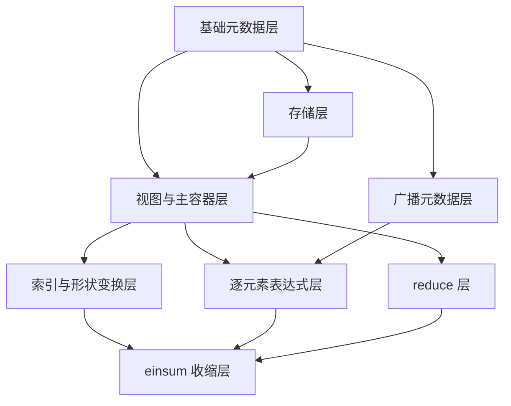

[toc]

---

# ndarray 设计文档

## 文档定位

本文档描述 `include/ndarray` 目录下固定秩 ndarray 库的当前设计与后续规划，目标是作为“实现、测试、文档”三者一致的单一事实源。

本文档已按当前代码状态修订，覆盖范围对应：

1. M1：核心容器与元数据。
2. M2：索引与形状变换。
3. M3：逐元素表达式系统。
4. M4：通用 reduce 框架。
5. M5：静态标签驱动的 einsum 核心子集。
6. M6：广播元数据、同秩广播表达式与 `broadcast_to` 接口。
7. 类 NumPy/神经网络业务张量测试。

---

# 1. 设计目标与当前边界

## 1.1 总体目标

当前 ndarray 库的定位不是通用动态张量运行时，而是一个面向 C++17、固定秩优先、头文件实现、强调可组合性与性能可控性的基础数值数组层。它主要服务于以下场景：

1. 环境观测张量的构造、切片、重排与 gather。
2. 神经网络中的逐元素、reduce、矩阵乘与一般张量收缩。
3. 注意力机制等高维张量前向/反向公式的参考实现。
4. 与 NumPy 参考脚本对拍，作为 CPU 侧正确性基线。

当前设计坚持以下原则：

1. 固定秩优先，输出秩尽量在编译期确定。
2. `ndarray` 负责所有权，`ndview` 负责零拷贝仿射访问。
3. 默认 row-major 连续布局。
4. 逐元素、reduce、einsum 共用统一的元数据与 view 体系。
5. 常见热点路径优先避免中间大临时张量。

## 1.2 当前已实现范围

当前代码已经实现下列能力：

| 模块 | 当前状态 | 说明 |
| --- | --- | --- |
| 元数据层 | 已实现 | `axis.hpp`、`shape.hpp`、`stride.hpp`、`layout.hpp`、`traits.hpp`、`utility.hpp` |
| 广播元数据 | 已实现 | `broadcast.hpp`：`broadcastable`、`broadcast_shape`、`pad_shape_left` |
| 存储层 | 已实现 | 对齐分配器 `aligned_allocator` 与 RAII 缓冲 `buffer` |
| 主容器与视图 | 已实现 | `ndarray<T, Rank>`、`ndview<T, Rank>` |
| 工厂函数 | 已实现 | `empty`、`zeros`、`ones`、`full`、`arange`、`linspace`、`from_buffer`、`*_like` |
| 标量索引 | 已实现 | 支持负下标规范化 |
| 仿射切片 | 已实现 | `view_all`、`range`、`new_axis` |
| 形状变换 | 已实现 | `reshape`、`flatten`、`permute`、`transpose`、`squeeze_axis`、`unsqueeze` |
| gather | 已实现 | `take_axis<Axis>` 返回新数组 |
| 逐元素表达式 | 已实现 | unary、binary、标量包装、`eval`、`eval_into`、NumPy 风格同秩广播 |
| 广播包装 | 已实现 | `broadcast_expr`、`broadcast_to`、二元算子自动广播 |
| 内建数学函数 | 已实现 | `abs`、`sqrt`、`exp`、`log`、三角函数、`tanh`、`sigmoid` |
| 自定义 unary | 已实现 | `transform(expr, fn)` |
| reduce | 已实现 | `reduce_axis`、`reduce_axis_keepdims`、`reduce_all` |
| reduce 包装 | 已实现 | `sum/prod/min/max/mean` 与 keepdims/all 变体 |
| einsum 标签系统 | 已实现 | `label_seq`、`contains`、`index_of`、`intersect`、`diff`、`classify` |
| 固定秩收缩内核 | 已实现 | `contract<L,R,O>`、`reduce_labels<I,O>` |
| 具名收缩包装 | 已实现 | `dot`、`matmul`、`batched_matmul`、`outer`、`trace` |

## 1.3 当前明确边界

以下内容当前仍不属于核心已交付能力：

1. 不同秩自动左补 1 的逐元素广播接入（完整 NumPy 风格广播的剩余部分）。
2. 布尔掩码索引与复杂花式索引组合。
3. 运行时动态秩主容器。
4. 字符串 `einsum("...")` 前端。
5. 自动并行调度、多线程内核与 GPU 后端。
6. 无参 `squeeze()`、省略号索引与运行时通用置换主接口。

---

# 2. 当前实现结构

## 2.1 分层结构

当前代码的分层结构如下：



各层职责如下：

1. 基础元数据层：定义 shape、stride、布局、索引类型与通用工具函数。
2. 广播元数据层：定义 shape 兼容判定、左补 1 规则与广播目标 shape 推导。
3. 存储层：管理连续缓冲与对齐分配策略。
4. 视图与主容器层：提供拥有型数组与非拥有型仿射视图。
5. 索引与形状变换层：负责切片、reshape、转置、gather 等结构变换。
6. 逐元素表达式层：负责延迟求值、广播包装与表达式组合。
7. reduce 层：负责按轴规约、keepdims 与全量规约。
8. einsum 收缩层：负责标签分类、轴重排与融合 contraction 内核。

## 2.2 当前文件组织

当前真实文件组织比最早规划更收敛，主要结构为：

```text
include/ndarray/
  ndarray.hpp
  core/
    axis.hpp
    shape.hpp
    stride.hpp
    layout.hpp
    broadcast.hpp
    traits.hpp
    utility.hpp
  storage/
    allocator.hpp
    buffer.hpp
  view/
    ndarray.hpp
    ndview.hpp
  indexing/
    slice.hpp
    reshape.hpp
    gather.hpp
  ops/
    expression.hpp
    unary.hpp
    binary.hpp
    math.hpp
    transform.hpp
  reduce/
    reduce.hpp
  einsum/
    labels.hpp
    contract.hpp
    einsum.hpp
```

  其中与广播机制直接相关的文件分工是：

  1. `core/broadcast.hpp` 负责 shape 兼容判定、左补 1 与输出 shape 推导。
  2. `ops/expression.hpp` 中的 `broadcast_expr` 负责逐元素广播时的逻辑索引折叠。
  3. `broadcast_to` 作为公开接口，把 view/array 包装为可继续参与表达式求值的广播表达式。

这说明当前实现遵循“少文件、强聚合、先把静态主路径做实”的策略，而不是一开始拆成过细的子模块。

---

# 3. 核心数据模型

## 3.1 `shape<Rank>` 与 `strides<Rank>`

元数据层使用固定长度结构保存 shape 与 stride，特点如下：

1. 秩 `Rank` 是模板参数。
2. `shape<Rank>` 提供 `total_size()`。
3. `strides<Rank>` 与 `row_major::compute_strides()` 配合使用。
4. 多数元数据操作都是轻量、可内联、接近零抽象成本的。

## 3.2 `ndarray<T, Rank>`

`ndarray` 是拥有型连续数组，当前承担以下职责：

1. 持有连续存储。
2. 保存 shape、stride、元素总数。
3. 提供标量索引与工厂函数配套构造。
4. 作为表达式求值目标。
5. 提供 `view()` / `cview()` 与 `clone()`。

当前特征：

1. 默认 row-major。
2. 默认连续存储。
3. 使用 `aligned_allocator` 提供对齐分配。
4. 可通过 `fill()`、`zero()` 快速初始化。

## 3.3 `ndview<T, Rank>`

`ndview` 是非拥有型仿射视图，当前语义边界明确：

1. 不负责释放内存。
2. 通过 `data + shape + strides` 描述访问。
3. 只要操作仍可由仿射 stride 表达，就优先返回 view。
4. 支持负下标、混合切片与非连续访问。

当前设计没有引入复杂的引用计数或共享所有权机制，保持了 view 的轻量属性。

## 3.4 `broadcast_expr<Expr>`

广播机制当前不是通过构造“伪连续广播数组”实现的，而是通过表达式层的逻辑包装实现的。`broadcast_expr<Expr>` 的角色可以概括为：

1. 不拥有数据，只包装原始 view/array/表达式。
2. 保存目标广播 shape，向外暴露广播后的逻辑尺寸。
3. 在访问长度为 1 的轴时，把逻辑索引折叠为 0，其余轴保持原索引访问。
4. 因而广播结果仍然是“惰性表达式”，可继续参与 `eval`、`eval_into`、数学函数、reduce 与更高层张量公式组合。

这个设计的直接好处是：广播被视为索引规则，而不是数据复制策略，因此能与当前固定秩表达式系统自然对接。

---

# 4. 已实现接口与关键设计

## 4.1 创建与复制

当前已提供以下创建入口：

1. `empty`
2. `zeros`
3. `ones`
4. `full`
5. `arange`
6. `linspace`
7. `from_buffer`
8. `zeros_like`、`ones_like`、`full_like`

当前复制语义：

1. `clone()` 为深拷贝。
2. `view()` / `cview()` 返回共享底层数据的视图。
3. `from_buffer` 当前语义是复制外部缓冲区内容生成新数组。

## 4.2 索引、切片与形状变换

### 4.2.1 标量索引

当前标量索引使用 `operator()`，支持：

1. 参数个数与秩匹配。
2. 负下标规范化。
3. debug 场景下的边界检查辅助函数。

### 4.2.2 仿射切片

当前切片层已经实现：

1. `view_all`
2. `range(start, stop, step)`
3. `new_axis`
4. 混合标量/范围/插轴描述符组合

当前约束与语义：

1. 标量索引消轴。
2. `new_axis` 插入长度为 1 的新轴。
3. `range` 与 `view_all` 保留轴。
4. 结果优先返回 `ndview<T, NewRank>`。

### 4.2.3 形状变换

当前已支持：

1. `reshape`
2. `flatten`
3. `permute<Perm...>`
4. `transpose`
5. `squeeze_axis<Axis>`
6. `unsqueeze<Axis>`

其中关键设计点是：

1. 连续场景优先零拷贝重解释。
2. 轴置换只调整 shape/stride，不物理搬运数据。
3. 输出秩始终由模板参数或固定规则决定。

### 4.2.4 gather

`take_axis<Axis>` 当前按 gather 复制语义实现，而不是复杂 indexed view。这是一个明确且合理的边界：

1. 列表索引通常不再是普通仿射视图。
2. 复制语义更利于性能预期与接口稳定。
3. 与切片 view 形成清晰区分。

## 4.3 逐元素表达式系统

当前表达式层由以下核心组件组成：

1. `expression_base<Derived>`：CRTP 基类。
2. `view_expr<T, Rank>`：将 `ndview` 接入表达式树。
3. `scalar_expr<T, Rank>`：将标量包装成逻辑广播叶节点。
4. `broadcast_expr<Expr>`：把长度为 1 的轴逻辑扩展到目标形状。
5. `unary_expr<Expr, Op>`：一元延迟表达式。
6. `binary_expr<Lhs, Rhs, Op>`：二元延迟表达式。
7. `eval` / `eval_into`：显式求值入口。

当前支持的逐元素接口包括：

1. `+`、`-`、`*`、`/`
2. 一元取负
3. `abs`、`sqrt`、`exp`、`log`
4. `sin`、`cos`、`tan`、`asin`、`acos`、`atan`
5. `tanh`、`sigmoid`
6. `transform(expr, fn)`

当前广播能力的实际范围是：

1. 同秩数组/视图/表达式之间的 NumPy 风格逐元素广播。
2. 数组、视图、表达式与标量之间的逐元素广播。
3. `broadcast_to(view/array, target_shape)` 的显式广播包装。
4. 不同秩输入的左补 1 规则已由 `pad_shape_left` 提供元数据基础，但尚未接入所有逐元素算子重载。

当前广播机制的接入链路如下：

1. `broadcastable` 与 `broadcast_shape` 先决定两个输入是否兼容，以及广播后的统一输出 shape。
2. 二元逐元素构造阶段根据 shape 差异决定是否引入 `broadcast_expr` 包装，而不是在调用点手工物化临时数组。
3. `binary_expr` 显式保存输出 shape，使广播后的表达式在继续组合时仍能保持正确的逻辑尺寸。
4. `broadcast_to` 提供手工指定目标 shape 的公开入口，适合 keepdims-reduce 之后的显式归一化或偏置扩展。
5. shape 不兼容时，当前实现通过断言尽早失败，避免把错误延后到求值阶段才暴露。

## 4.4 reduce 框架

当前 reduce 层已经按静态轴接口成型：

1. `reduce_axis<Axis>`
2. `reduce_axis_keepdims<Axis>`
3. `reduce_all`

在此之上已经提供：

1. `sum`
2. `prod`
3. `min`
4. `max`
5. `mean`

并同时支持：

1. 按轴规约。
2. keepdims 变体。
3. 全量规约。
4. 自定义 reducer。

当前实现的核心思路是“递归遍历非规约轴，在叶节点对目标轴执行规约”，因此：

1. 不依赖输入连续性。
2. 代码结构清晰。
3. 后续可在不改接口的前提下替换为更激进的快路径内核。

## 4.5 einsum 核心子集

当前 M5 的重点不是字符串解析，而是“固定秩、标签驱动、可融合的收缩内核”。目前已实现：

1. `label_seq<'i','j',...>` 标签序列。
2. `contains`、`index_of`、`intersect`、`diff`、`concat`、`unique`。
3. `classify<Lhs, Rhs, Out>`，把标签分为 `B/M/N/K` 四组。
4. `contract<LhsLabels, RhsLabels, OutLabels>`。
5. `reduce_labels<InLabels, OutLabels>`。
6. `dot`、`matmul`、`batched_matmul`、`outer`、`trace` 具名包装。

当前 contraction 主内核的执行逻辑为：

1. 编译期完成标签分类与置换数组生成。
2. 运行期将左右输入重排到规范序 `[B,M,K]` 与 `[B,K,N]`。
3. 对各组轴做 extent 折叠。
4. 以融合的 batched contraction 内层循环完成乘加。
5. 如输出标签序与规范序不同，再执行一次物理重排。

这个实现已经足以覆盖当前测试中的矩阵乘、批矩阵乘、外积、迹，以及注意力相关的代表性 contraction。

---

# 5. 性能策略

## 5.1 当前性能策略

当前代码明确采用以下性能策略：

1. `ndarray` 默认连续存储。
2. 能返回 view 的结构变换优先零拷贝。
3. `take_axis` 明确采用复制语义，不伪装成廉价 view。
4. 表达式系统默认延迟求值，避免不必要中间数组。
5. `ndview::fill()` 对连续视图有快路径。
6. reduce 保持 stride 正确性，并为后续专门快路径预留接口层稳定性。
7. einsum 采用融合 contraction，而不是机械拆成“先乘后 sum”的中间张量方案。
8. 广播通过 `broadcast_expr` 做逻辑索引映射，不默认物化临时数组。
9. 同形状逐元素路径仍保持直接表达式求值语义，只有确实出现长度为 1 的轴扩展时才进入广播索引折叠逻辑。

## 5.2 当前实现的性能含义

从现有代码出发，可以明确以下结论：

1. 标量索引与元数据访问是常数时间。
2. 仿射切片、转置、插轴、消轴的构造成本近似与秩线性相关。
3. gather 的成本与输出元素数线性相关。
4. 表达式求值、reduce 与 contraction 当前都以单线程 CPU 内核为主。
5. einsum 当前优先正确性、结构清晰和后续可扩展性，而不是一开始就引入复杂调度或分块优化。

## 5.3 后续性能优化方向

以下优化方向已经由当前结构自然预留，但尚未落地：

1. 连续 reduce 的专门最内层快路径。
2. contraction 的 blocking 与缓存友好循环次序。
3. SIMD 向量化辅助 traits。
4. 多线程任务划分。
5. GPU/异构后端。

---

# 6. 测试与验证

## 6.1 当前测试覆盖

当前测试目录为 `test/test-ndarray/src`，已经形成按阶段递进的验证结构：

1. `test_m1.cpp`：容器、shape/stride、工厂函数、clone、view。
2. `test_m2.cpp`：负下标、切片、reshape、flatten、permute、transpose、squeeze/unsqueeze、take_axis。
3. `test_m3.cpp`：逐元素四则、数学函数、`transform`、表达式组合、`eval_into`。
4. `test_m4.cpp`：通用 reduce、自定义 reducer、keepdims、三维规约。
5. `test_m5.cpp`：标签系统、`contract`、`reduce_labels`、`dot`、`matmul`、`batched_matmul`、`outer`、`trace`。
6. `test_m6.cpp`：广播元数据、`broadcast_to`、同秩逐元素广播、三维广播、`eval_into` 广播回归。

其中 `test_m6.cpp` 当前已经覆盖 14 个广播相关用例，分别是：

1. 元数据兼容判定。
2. `pad_shape_left` 左补 1。
3. `broadcast_to` 显式广播。
4. 尾轴广播。
5. 行向量与列向量广播。
6. 矩阵与行向量广播。
7. 标量广播回归。
8. 广播与数学函数组合。
9. 四则运算全覆盖。
10. 三维广播。
11. 混合三维广播。
12. Linear bias 广播。
13. 同形状回归。
14. `eval_into` 与广播组合回归。

## 6.2 当前 NumPy/神经网络代表性验证

除阶段测试外，当前还增加了 `test_final.cpp`，用于验证“更贴近真实模型代码”的张量公式。当前已覆盖：

1. `Linear.backward` 风格的前向、激活梯度、输入梯度、参数梯度与 bias 梯度。
2. 缩放点积注意力前向中的两个核心 contraction。
3. 注意力反向传播中的代表性权重梯度 contraction。

这些测试的意义在于：

1. 它们不是孤立 API 冒烟，而是多种能力的组合验证。
2. 它们能直接暴露当前广播能力、矩阵乘、转置、reduce 与 contraction 的协同边界。
3. 它们与 `python/agent_numpy.py` 的公式保持一致，适合作为后续性能优化前的正确性锚点。
4. 在 M6 之后，线性层 bias 加法与 softmax 归一化已经可以直接写成广播表达式，不再需要手工偏置循环。

## 6.3 后续高性能计算验证建议

后续测试与基准应继续保留“基础功能测试 + 代表性模型计算测试”两条线，并补充以下场景：

1. 多头注意力前向完整路径。
2. softmax backward 的融合实现与对拍。
3. LSTM/GRU 前向与反向中的门控张量公式。
4. 更大尺寸矩阵乘、batched contraction 与 reduce 的微基准。

---

# 7. 未实现功能与扩展点

本章只记录“尚未实现”或“已明确预留”的内容，避免与当前已交付能力混写。

## 7.1 接口层待补能力

1. 不同秩输入的自动广播接入：在现有 `pad_shape_left` 元数据基础上，把完整 NumPy 风格广播补齐到所有逐元素入口。
2. 运行时轴便捷重载，如 `take_axis(axis, ids)` 风格包装。
3. 无参 `squeeze()` 或多轴 `squeeze_axes<...>()` 的更完整接口族。
4. 更丰富的高级索引，如布尔掩码与复杂花式索引。
5. 通用字符串 `einsum` facade。

## 7.2 计算内核扩展点

1. 连续/非连续 reduce 的分派优化。
2. contraction 的分块、缓存优化与 SIMD。
3. 多线程 CPU 后端。
4. GPU 计算后端。
5. 动态秩外层封装，用于承接更灵活但类型不如固定秩稳定的接口。

---

# 8. 任务分解与任务记录

## 8.1 已完成里程碑

| 里程碑 | 状态 | 当前结果 |
| --- | --- | --- |
| M1 | 已完成 | 固定秩 shape/stride、`ndarray`、`ndview`、工厂函数与基础测试完成 |
| M2 | 已完成 | 负下标、切片、reshape、flatten、permute、transpose、squeeze/unsqueeze、take_axis 完成 |
| M3 | 已完成 | 表达式模板、一元/二元运算、内建数学函数、`transform`、`eval`/`eval_into` 完成 |
| M4 | 已完成 | 通用 reduce 与 `sum/prod/min/max/mean` 完成 |
| M5 | 已完成 | 标签系统、`contract`、`reduce_labels` 与具名静态收缩算子完成 |
| M6 | 已完成 | `broadcast.hpp`、`broadcast_expr`、`broadcast_to`、同秩逐元素广播与 M6 测试完成 |
| 类 NumPy 业务测试 | 已完成 | `test_final.cpp` 已覆盖线性层与注意力张量公式，并使用广播表达 bias/softmax 归一化 |

## 8.2 当前阶段任务

当前阶段应视为“M6 落地后的收敛与扩展准备”阶段，重点包括：

1. 持续保持 M1~M6、`test_m6.cpp` 与 `test_final.cpp` 的代码、文档、测试一致。
2. 为广播路径与同形状路径补充微基准，确认广播包装不引入不必要回归。
3. 评估是否将“不同秩自动广播”作为下一阶段的接口扩展重点。

## 8.3 下一阶段建议任务

建议把下一阶段拆为以下顺序：

1. M7：广播、reduce、contraction 的性能快路径与微基准。
2. M8：不同秩自动广播、更完整高级索引与接口族补齐。
3. M9：多线程/GPU/动态秩外层等扩展点按需要推进。

其中 M7 的交付标准应至少包括：

1. 对连续主路径与广播主路径分别给出可复现的微基准。
2. 验证 `broadcast_expr` 不会破坏现有同形状路径的时间与空间行为。
3. 为 reduce / contraction 增补至少一类专门快路径或基准数据。

---

# 9. 文档维护约定

本文档后续维护必须遵守以下约定：

1. 已实现能力写“当前状态”，未实现能力统一写入“未实现功能与扩展点”。
2. 每新增一个稳定接口，都要同时更新：设计文档、代码注释、测试覆盖。
3. 每完成一个里程碑，都要在“任务分解与任务记录”中更新状态。
4. 若实现与文档不一致，必须尽快决定是修正文档还是回调实现，避免长期漂移。
5. 代表性模型测试的新增或删除，也必须同步更新“测试与验证”章节。

---

# 10. 设计摘要

当前 ndarray 库已经形成一个完整的固定秩数值数组核心层，其关键结论如下：

1. `ndarray<T, Rank>` 与 `ndview<T, Rank>` 的职责边界已经清晰稳定。
2. 索引、形状变换、逐元素、reduce 与 einsum 已经在同一元数据体系下贯通。
3. 当前 M1~M6 已完成，且已有贴近神经网络公式的类 NumPy 业务验证。
4. 当前更值得继续推进的不是重写核心容器，而是跨秩自动广播、性能快路径与更完整高阶索引。
5. 多线程、GPU、动态秩 facade 与字符串 `einsum` 仍应作为独立扩展层，在核心语义和性能路径稳定后推进。
6. 后续工作应坚持“先巩固接口语义，再做快路径优化，最后扩展后端”的顺序。
