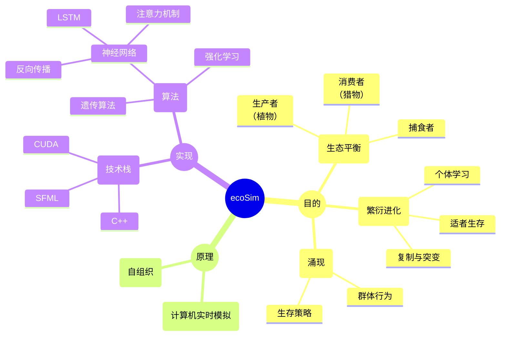
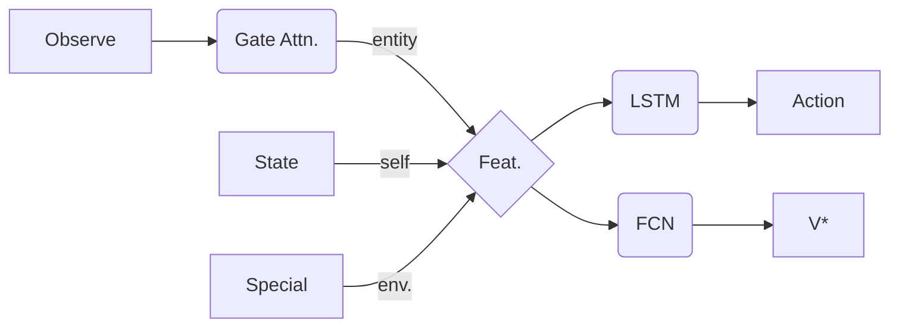
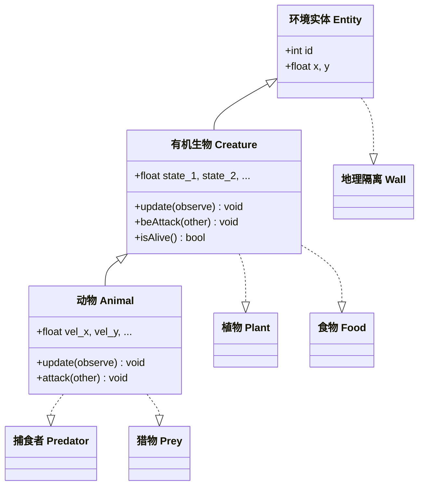
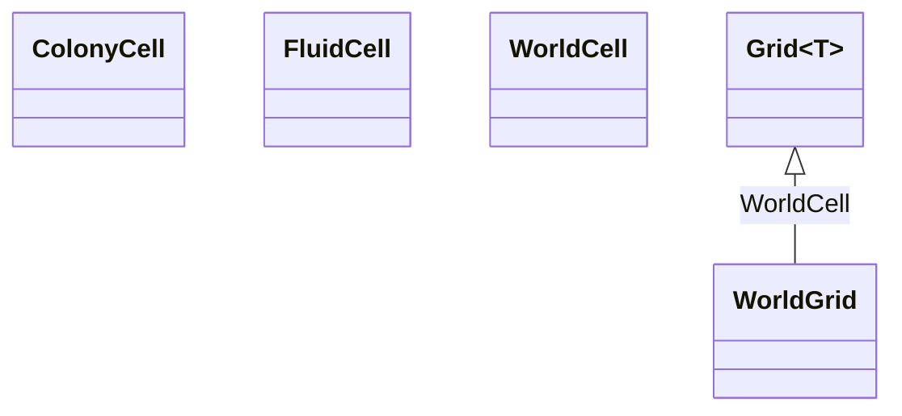
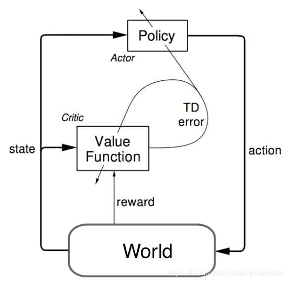
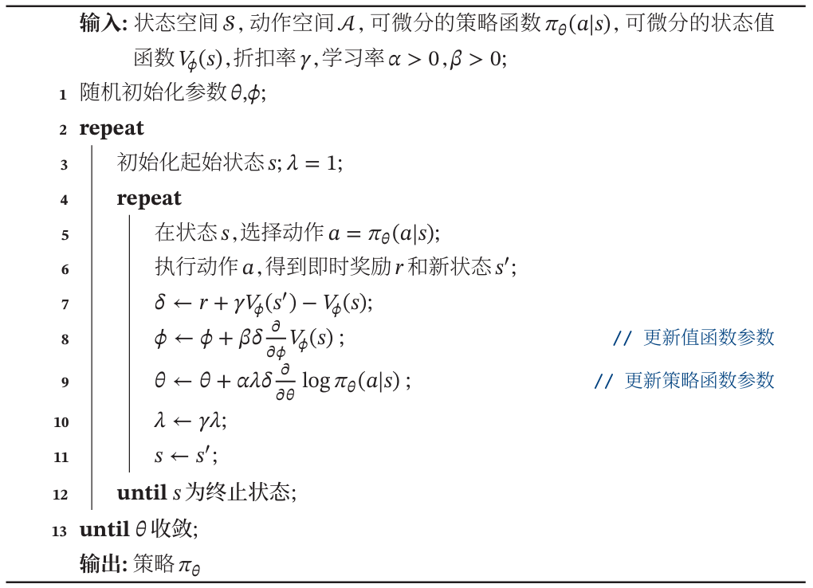

[toc]

---


# ✨总览


## 项目简介

该项目构建了一个简化的生态模型，用于模拟大量捕食者与猎物间的自然选择与生存博弈。灵感来源于视频[BV1oH1sB5Euz](https://b23.tv/cDI3Jbg "进化AI系列：复杂环境下的捕食者&猎物")并引入了更复杂的机制和算法。

**创新点：**

* 生物改进

- [x] 引入个体学习（个体独立进行强化学习，并使用反向传播调整权重）

- [x] 加入个体记忆（使用长短期记忆网络LSTM作为生物的“大脑”，代替遗传BP神经网络）
- [x] 更高效的环境感知（使用门控注意力[^1]提取环境信息）

* 环境改进

- [x] 植物不再随机扩张，而是和气候变化相关

- [ ] 加入地形对生物的影响（如地理隔绝）


[^1]: Gated Attention for Large Language Models: Non-linearity, Sparsity, and Attention-Sink-Free，论文链接：<https://openreview.net/forum?id=1b7whO4SfY>，代码链接：<https://github.com/qiuzh20/gated_attention>，NeurIPS 2025最佳论文——千问门控注意力


## 思维导图



---


# ⚙系统模型

模型速览表：

|            | 植物 | 猎物 | 捕食者 | 食物 | 地理隔离     |
| ---------- | ---- | ---- | ------ | ---- | ------------ |
| 有物理实体 | 是   | 是   | 是     | 是   | 是（预计算） |
| 动态性     | 是   | 是   | 是     | 是   | *否*         |
| 可被攻击的 | 是   | 是   | 是·    | 是   | *否*         |
| 可攻击的   | *否* | 是   | 是     | *否* | *否*         |
| 可食用性   | 是   | *否* | *否*   | 是   | *否*         |


## 植物

在食物链中，植物属于生产者，是整个生态系统的基石。植物会在固定的位置**随时间自然生长**，当生长到最大值时则会向附近的地段扩张（产生新的植物实体）。不同生长阶段的植物拥有不同的体积（或空间密度），这会影响视线的穿透，因此动物可以藏匿其中。初始时会有一些植物分布于环境的某些位置，正常情况下植物会从这些位置逐渐生长蔓延，但实际上没有植物的空地也有小概率生长出植物，这类似于自然界中种子的**风传播**。

注意，植物的生长速度、迁移率、甚至是可食用率都会在一定程度上受到地理环境和气候的影响，详见[非生物环境](#非生物环境)小节。


## 动物（捕食者＆猎物）

在食物链中，动物属于消费者，在能量流动关系中位于植物的下游。不同于植物可以随时间不断生长，动物需要通过捕食才能生存和繁衍，繁衍方式具体分为以下两种：

1. 无性生殖：复制+突变，不同种族各自进化；

2. 有性生殖：杂交+突变，基因交流频繁，不存在明显的种族区分。

食物充足的动物能够存活的更久，因此拥有更多的繁衍机会，但是由于自然寿命的限制，即使食物充足动物也会在一定的时间后死亡。动物死亡后（被猎杀、饿死或是老死），会在原地留下可供捕食者食用的食物，该食物会随时间很快消失（即腐败）。猎物则以植物为食。

### 统一架构



训练方式：

- 强化学习：单个个体生命周期内，使用单步更新的优势演员-评论员算法（Advantage Actor-Critic, A2C）更新网络参数；
- 遗传算法：产生新个体时，将网络参数向量化后执行多点交叉和高斯扰动变异；

物理量定义：

* 观测（Observe）：由环境返回最多$M$个临近实体的位置、速度、类型、标志位构成的二维矩阵；
* 状态（State）：自身的血量、耐力、饥饿值、繁育值构成的一维向量；
* 特殊（Special）：环境状态如天气变化、昼夜节律等构成的一维向量；
* 融合特征（Feature）：包含所有外部和内部状态信息的一维特征向量；

* 动作（Action）：x、y速度分量，或是速度模、角速度；
* 状态值函数（V*）：当前状态下对未来总回报的预测值；

模块定义：

* 门控注意力（Gate Attention）：从二维环境观测中提取一维特征（全局的、共享的 or 个体独立的）；

* 长短期记忆网络（LSTM）：为智能体提供带短期记忆功能的决策网络；

* 全连接网络（FCN）：简单的价值网络；

### 猎物

 在食物链中，猎物属于第一级消费者。它们喜欢成群结队觅食，并通过大量摄取植物来保持存活和繁衍。猎物的运动能力强但视野范围较小，可以通过以下几种方式来躲避捕食者的追杀：快速逃离、藏匿于植物中、有组织的反击。

### 捕食者

在食物链中，捕食者属于第二级消费者，通过攻击猎物来获取食物。在狩猎过程中，捕食者可以单独行动，也可以依赖高级的策略同其他捕食者配合行动。捕食者的运动能力强、视野范围大、且攻击伤害比猎物更高。当猎物因攻击死亡后，会在原地留下大量食物，该食物在捕食者间共享且需要一定的时间才能食用完毕，因此可以期望捕食者在这种机制下逐渐形成团队配合的能力。


## 非生物环境

环境由一个*4096x4096*（或其他大小）的平面网格构成，用于承载可以被感知到的物理实体（主要是动物和植物）。植物于固定位置自然生长，动物则可以自由运动。环境中存在一些**地理和生物屏障**，可能会阻碍视线甚至是阻止动物的运动。除此之外**局部气候**、**昼夜节律**等也归属于非生物环境。

整个系统按时间离散，其中非生物环境的更新周期作为最小刷新间隔，生物的思考和行动周期（包括生物的运动及状态）也与之保持一致，生物的学习周期则略长，在多轮行动后才使用累积的“经验”更新自身行动策略。

类似于下图，非生物环境能够对生态环境的全貌进行实时高质量渲染。渲染基于上帝视角并使用了卡通动画效果，同时还支持模拟控制、视角平移和缩放、系统监视器、展示单个生物概况等功能。


## 能量守恒关系

在生态系统的模拟中，需要考虑能量的流动路径以及食物链每级的能量传递效率，以保证系统整体和局部的能量守恒。

具体来讲，植物通过光合作用将光能固定为生物能并储存在自身的有机质中，该过程效率较低，且会受到光照条件（昼夜变化、天气变化）的影响，但优势在于持续时间长，能够作为整个生态系统的能量输入持续积累能量；猎物通过食用植物获取有机质，该过程能量传递效率同样较低，但由于猎物的觅食行为，其单个个体的能量密度显著大于植物；捕食者通过捕食猎物获取能量，这个过程涉及到动物到食物的转换，能量传递效率较高。

生态系统中能量传递的基本原则是：输入的能量必须大于输出的能量。对于食物链中的动物群体，能量总量逐级递减；对于单个个体，存活、运动、繁衍均需要消耗能量，且能量总量随年龄近似呈卡方分布。因此，建模时涉及能量传递的关键环节，如进食、生物体状态更新等，需要参考上述原则设置合适的参数大小和比例。

... ...


---


# 🎨具体实现


## C++项目结构

整个项目基于Microsoft Visual Studio构建Cmake工程，最终目的是编写一个实时运行生态系统模拟的轻量化程序。

... ...

使用纯cuda实现神经网络的前向计算和反向传播（反向传播公式需要手动推导），不借助如pytorch等庞大的机器学习框架。用于承载生物的环境使用c++实现，程序窗口的渲图形化染使用轻量的[SFML库](https://www.sfml-dev.org/ "开源、跨平台的C++多媒体库")。

... ...

使用

### 主循环

```c++
├─ scence->update()
│  ├─ 遍历所有实体：
│  │  ├─ 构建距离场
│  │  └─ 交互检测
│  ├─ 遍历动物群体（异步）：
│  │  ├─ 计算环境观测和奖励
│  │  ├─ 智能体计算（GPU交互*）
│  │  └─ 状态更新、位置更新
│  ├─ 更新其他实体状态、更新环境状态
│  ├─ 新增/删除实体
│  └─ 更新渲染统计
│
└─ scence->render()
   ├─ 清空背景
   ├─ 绘制实体
   └─ 交换缓冲
```

> **注意：**GPU交互时由于存在并行计算的两个设备，智能体计算和环境更新同时进行，会导致***时间步交错***现象，即状态$s$的更新取决于上一时间步的状态：
> $$
> s_{t+1}=s_t+f(s_{t}),&\qquad正常\\
> s_{t+1}=s_t+f(s_{t-1}),&\qquad时间步交错
> $$
> 下面两幅图分别给出了两种情况下的详细更新顺序：
>
> - 串行序列（正常）：
>
> ```mermaid
> gitGraph
>   commit id: "ZERO" type: HIGHLIGHT
>   branch cache
>   branch worker
>   checkout main
>   
>   commit id: "计算距离场_0"
>   checkout cache
>   merge main id: "Obs_0"
>   checkout worker
>   merge cache id: "智能体计算_0"
>   checkout main
>   merge worker id: "状态更新_0"
>   
>   commit id: "State_0" type: HIGHLIGHT tag: "State ( t - 1 )"
>   commit id: "计算距离场_1"
>   checkout cache
>   merge main id: "Obs_1"
>   checkout worker
>   merge cache id: "智能体计算_1"
>   checkout main
>   merge worker id: "状态更新_1"
>   
>   commit id: "State_1" type: HIGHLIGHT tag: "State ( t )"
>   commit id: "计算距离场_2"
>   checkout cache
>   merge main id: "Obs_2"
>   checkout worker
>   merge cache id: "智能体计算_2"
>   checkout main
>   merge worker id: "状态更新_2"
>   
>   commit id: "State_2" type: HIGHLIGHT tag: "State ( t + 1 )"
>   commit id: "计算距离场_3"
>   checkout cache
>   merge main id: "Obs_3"
>   checkout worker
>   merge cache id: "智能体计算_3"
>   checkout main
>   merge worker id: "状态更新_3"
>   
>   commit id: "... ... CPU" type: REVERSE
>   checkout worker
>   commit id: "... ... GPU" type: REVERSE
> ```
>
> - 并行序列（时间步交错）：
>
> ```mermaid
> gitGraph
>   commit id: "ZERO" type: HIGHLIGHT
>   branch cache
>   branch worker order: 2
>   #commit id: "智能体计算_0"
>   
>   checkout main
>   commit id: "State_1" type: HIGHLIGHT tag: "State ( t - 1 )"
>   checkout main
>   commit id: "计算距离场_0"
>   checkout cache
>   merge main id: "Obs_0"
>   checkout main
>   merge worker id: "随机状态更新"
>   checkout worker
>   merge cache id: "智能体计算_0"
>   
>   checkout main
>   commit id: "State_1" type: HIGHLIGHT tag: "State ( t - 1 )"
>   commit id: "计算距离场_1"
>   checkout cache
>   merge main id: "Obs_1"
>   checkout main
>   merge worker id: "状态更新_1"
>   checkout worker
>   merge cache id: "智能体计算_1"
>   
>   checkout main
>   commit id: "State_2" type: HIGHLIGHT tag: "State ( t )"
>   commit id: "计算距离场_2"
>   checkout cache
>   merge main id: "Obs_2"
>   checkout main
>   merge worker id: "状态更新_2"
>   checkout worker
>   merge cache id: "智能体计算_2"
>   
>   checkout main
>   commit id: "State_3" type: HIGHLIGHT tag: "State ( t + 1 )"
>   commit id: "计算距离场_3"
>   checkout cache
>   merge main id: "Obs_3"
>   checkout main
>   merge worker id: "状态更新_3"
>   checkout worker
>   merge cache id: "智能体计算_3"
>   
>   checkout main
>   commit id: "... ... CPU" type: REVERSE
>   checkout worker
>   commit id: "... ... GPU" type: REVERSE
> ```
>
> CPU单独计算或CPU、GPU串行计算时则不存在该问题。目前还不清楚时间步交错对模拟的影响。但是考虑到智能体的计算是异步进行的，当智能体数量远大于CPU和GPU的线程数时，单个智能体的串行对性能的影响微乎其微，因此程序默认使用***串行+异步***的方式进行时间步的迭代。

### 主要数据结构

依据模块化、可扩展的原则组织代码，将代码划分为以下几个独立的vs项目（存在依赖关系 $1\to2\to3$）：

1. **智能体（agent）：**[动物](#动物)和[植物](#植物)的运行逻辑。可以分为CPU、GPU两类硬件，固定逻辑、简单前馈神经网络、注意力+LSTM网络三种算法实现。
- 对外接口：环境信息输入、状态量输出；
  
- 功能：按照特定规则或算法，描述处于环境中的生物的动态行为；
2. **环境（world）：**承载智能体的容器。包含交互逻辑和[非生物环境](#非生物环境)的定义。
- 对外接口：获取所有实体的位置以及环境状态、统计信息查询；
  
- 功能：控制大量实体间的交互，实时运行一个有限的、完全可观测的自然生态；
3. **模拟程序（main）：**整合智能体和环境完成最终的模拟。支持独立运行渲染、也支持外部调用（如python）。
   - 对外接口：模拟控制、渲染控制、环境接口；
   - 功能：作为一个程序外壳，为用户提供控制、访问、可视化等功能；

其中智能体包含以下类继承关系：



世界网格（详见[环境的高效实现](#环境的高效实现)小节）包含以下类继承关系：




## 关键问题

### 环境的高效实现

假设环境实体数量为$N_{entity}$，对于每个实体需要计算出附近最近的$M$个实体，并获取他们的位置距离等信息作为自己的输入（环境观测）。若统一计算整个环境，计算复杂度为$O(n^2)$，当实体规模非常大时（如$N_{entity}\ge10,000$）其计算成本是难以接受的。为此通过引入世界网格将整个环境离散化，将


## 启发式

动物架构的简化：将注意力机制和LSTM结合，

... ...

A2C算法的训练技巧包括[^2]：

- [x] 多维度奖励
- [x] 延迟的策略更新
- [ ] 重放缓冲区
- [ ] 目标价值网络
- [x] 熵正则化
- [ ] 标签平滑

下图则给出了该算法的详细介绍：






[^2]: [[1610.01945\] Connecting Generative Adversarial Networks and Actor-Critic Methods](https://arxiv.org/abs/1610.01945)，演员评论员架构的训练技巧

