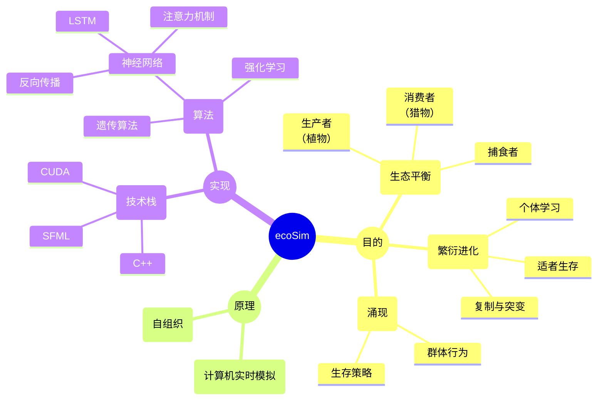
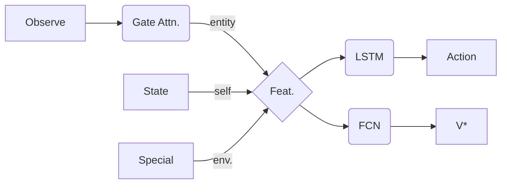
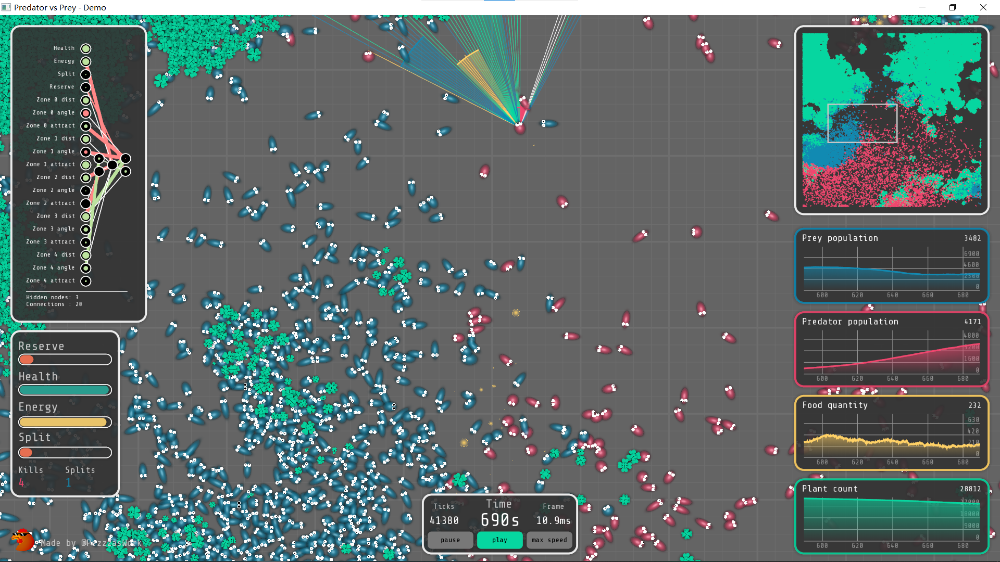

[toc]

---

# ✨总览

## 项目简介

该项目构建了一个简化的生态模型，用于模拟大量捕食者与猎物间的自然选择与生存博弈。灵感来源于视频[BV1oH1sB5Euz](https://b23.tv/cDI3Jbg "进化AI系列：复杂环境下的捕食者&猎物")并引入了更复杂的机制和算法。

**创新点：**

* 生物改进

- [x] 引入个体学习（个体独立进行强化学习，并使用反向传播调整权重）

- [x] 加入个体记忆（使用长短期记忆网络LSTM作为生物的“大脑”，代替遗传BP神经网络）
- [x] 更高效的环境感知（使用门控注意力[^1]提取环境信息）

* 环境改进

- [x] 植物不再随机扩张，而是和气候变化相关

- [ ] 加入地形对生物的影响（如地理隔绝）

[^1]: Gated Attention for Large Language Models: Non-linearity, Sparsity, and Attention-Sink-Free，论文链接：<https://openreview.net/forum?id=1b7whO4SfY>，代码链接：<https://github.com/qiuzh20/gated_attention>，NeurIPS 2025最佳论文——千问门控注意力

## 思维导图

---

# ⚙系统模型

## 植物

在食物链中，植物属于生产者，是整个生态系统的基石。植物会在固定的位置**随时间自然生长**，当生长到最大值时则会向附近的地段扩张（产生新的植物实体）。不同生长阶段的植物拥有不同的体积（或空间密度），这会影响视线的穿透，因此动物可以藏匿其中。初始时会有一些植物分布于环境的某些位置，正常情况下植物会从这些位置逐渐生长蔓延，但实际上没有植物的空地也有小概率生长出植物，这类似于自然界中种子的**风传播**。

注意，植物的生长速度、迁移率、甚至是可食用率都会在一定程度上受到地理环境和气候的影响，详见[非生物环境](#非生物环境)小节。

## 动物（捕食者＆猎物）

在食物链中，动物属于消费者，在能量流动关系中位于植物的下游。不同于植物可以随时间不断生长，动物需要通过捕食才能生存和繁衍，繁衍方式具体分为以下两种：

1. 无性生殖：复制+突变，不同种族各自进化；

2. 有性生殖：杂交+突变，基因交流频繁，不存在明显的种族区分。

食物充足的动物能够存活的更久，因此拥有更多的繁衍机会，但是由于自然寿命的限制，即使食物充足动物也会在一定的时间后死亡。动物死亡后（被猎杀、饿死或是老死），会在原地留下可供捕食者食用的食物，该食物会随时间很快消失（即腐败）。猎物则以植物为食。

### 统一架构

物理量定义：

* 观测（Observe）：由环境返回附近
* 状态（State）：
* 特殊（Special）：
* 融合特征（Feature）：

* 动作（Action）：
* 状态值函数（V*）：

模块定义：

* 门控注意力（Gate Attention）：全局的、共享的 or 个体独立的
* 长短期记忆网络（LSTM）：
* 全连接网络（FCN）：

### 捕食者

... ...

### 猎物

... ...

## 非生物环境

环境由一个*4096x4096*（或其他大小）的平面网格构成，用于承载可以被感知到的物理实体（主要是动物和植物）。植物于固定位置自然生长，动物则可以自由运动。环境中存在一些**地理和生物屏障**，可能会阻碍视线甚至是阻止动物的运动。除此之外**局部气候**、**昼夜节律**等也归属于非生物环境。

整个系统按时间离散，其中非生物环境的更新周期作为最小刷新间隔，生物的思考和行动周期（包括生物的运动及状态）也与之保持一致，生物的学习周期则略长，在多轮行动后才使用累积的“经验”更新自身行动策略。

类似于下图，非生物环境能够对生态环境的全貌进行实时高质量渲染。渲染基于上帝视角并使用了卡通动画效果，同时还支持模拟控制、视角平移和缩放、系统监视器、展示单个生物概况等功能。

## 能量守恒关系

... ...

---

# 🎨具体实现

## 启发式

动物架构的简化：将注意力机制和LSTM结合，

... ...

A2C算法，

- 多维度奖励
- 延迟的策略更新

## C++项目结构

整个项目基于Microsoft Visual Studio构建Cmake工程，最终目的是编写一个实时运行生态系统模拟的轻量化程序。

... ...

使用纯cuda实现神经网络的前向计算和反向传播（反向传播公式需要手动推导），不借助如pytorch等庞大的机器学习框架。用于承载生物的环境使用c++实现，程序窗口的渲图形化染使用轻量的[SFML库](https://www.sfml-dev.org/ "开源、跨平台的C++多媒体库")。

... ...

