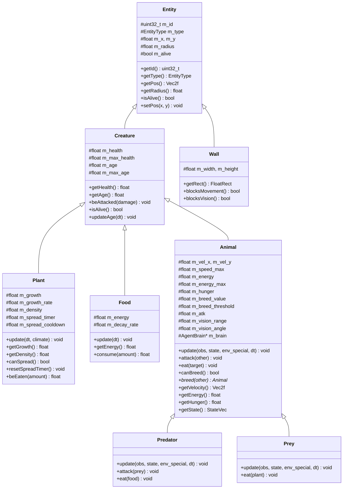
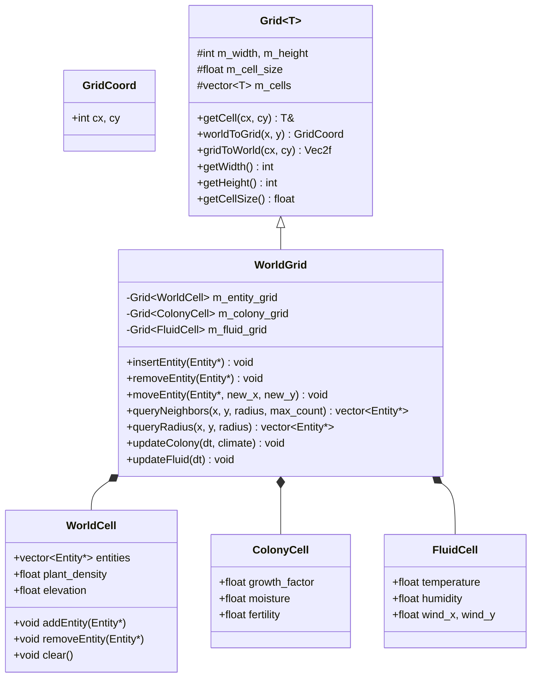

[toc]

---


# 1 项目架构总览


## 1.1 模块划分

项目按照 **依赖方向** $1 \to 2 \to 3$ 划分为三个核心子项目和若干辅助模块：

| 子项目 | 目录 | 职责 | 对外接口 |
|--------|------|------|----------|
| **agent** | `agent/` | 智能体（动物和植物）的数据结构、行为逻辑与神经网络 | 环境信息输入、状态量/动作输出 |
| **world** | `world/` | 承载智能体的环境容器、交互逻辑、网格系统、气候与昼夜 | 实体位置与环境状态查询、统计信息 |
| **main** | `main/` | 整合 agent 和 world 完成模拟循环、SFML 渲染与用户交互 | 模拟控制、渲染控制、Python 外部调用 |

辅助模块：

| 模块 | 目录 | 说明 |
|------|------|------|
| **test-sfml** | `test/test-sfml/` | SFML 图形功能测试 |
| **test-cuda** | `test/test-cuda/` | CUDA 计算功能测试 |
| **python** | `python/` | Python 原型实现（参考算法验证用） |
| **external** | `external/` | 第三方依赖（SFML 及其依赖库） |


## 1.2 目标文件结构

```
ecoSim/
├── CMakeLists.txt                  # 顶层 CMake
├── ecoSim.md                       # 项目文档
├── framework.md                    # 本文件：实现方案
│
├── agent/                          # 子项目1：智能体
│   ├── CMakeLists.txt
│   ├── include/
│   │   ├── config.hpp              # 全局配置常量
│   │   ├── utils.hpp               # 工具函数（随机数等）
│   │   ├── entity.hpp              # 实体基类 Entity
│   │   ├── creature.hpp            # 有机生物 Creature
│   │   ├── animal.hpp              # 动物 Animal
│   │   ├── plant.hpp               # 植物 Plant
│   │   ├── food.hpp                # 食物 Food
│   │   ├── wall.hpp                # 地理隔离 Wall
│   │   ├── predator.hpp            # 捕食者 Predator
│   │   ├── prey.hpp                # 猎物 Prey
│   │   ├── observe.hpp             # 环境观测数据结构
│   │   ├── brain.hpp               # 神经网络基类
│   │   ├── nn_layers.hpp           # 网络层（Linear, GQA, LSTM）
│   │   └── agent_brain.hpp         # 完整 Agent 大脑（AttnLSTM + Actor + Critic）
│   └── src/
│       ├── entity.cpp
│       ├── creature.cpp
│       ├── animal.cpp
│       ├── plant.cpp
│       ├── food.cpp
│       ├── wall.cpp
│       ├── predator.cpp
│       ├── prey.cpp
│       ├── nn_layers.cpp           # CPU 版神经网络层实现
│       ├── nn_layers.cu            # GPU 版神经网络层实现（CUDA）
│       └── agent_brain.cpp
│
├── world/                          # 子项目2：环境
│   ├── CMakeLists.txt
│   ├── include/
│   │   ├── world_config.hpp        # 环境配置
│   │   ├── grid.hpp                # 通用网格模板 Grid<T>
│   │   ├── world_cell.hpp          # 世界网格单元
│   │   ├── world_grid.hpp          # 世界网格
│   │   ├── colony_cell.hpp         # 群落单元（植物扩张）
│   │   ├── fluid_cell.hpp          # 流体单元（气候模拟）
│   │   ├── climate.hpp             # 气候系统
│   │   ├── day_night.hpp           # 昼夜节律
│   │   ├── entity_manager.hpp      # 实体管理器
│   │   └── scene.hpp               # 场景（主更新循环）
│   └── src/
│       ├── grid.cpp
│       ├── world_grid.cpp
│       ├── climate.cpp
│       ├── day_night.cpp
│       ├── entity_manager.cpp
│       └── scene.cpp
│
├── main/                           # 子项目3：主程序
│   ├── CMakeLists.txt
│   ├── src/
│   │   ├── main.cpp                # 入口
│   │   ├── renderer.cpp            # SFML 渲染器
│   │   ├── renderer.hpp
│   │   ├── camera.cpp              # 视角控制
│   │   ├── camera.hpp
│   │   ├── ui.cpp                  # UI 覆盖层（统计、选中实体信息）
│   │   ├── ui.hpp
│   │   ├── event.cpp               # 用户输入事件处理
│   │   ├── event.hpp
│   │   ├── sim_controller.cpp      # 模拟控制器（暂停/继续/速率）
│   │   └── sim_controller.hpp
│   └── res/                        # 资源文件夹（纹理、字体等）
│
├── test/                           # 测试
│   ├── test-sfml/
│   ├── test-cuda/
│   └── test-agent/                 # 新增：智能体单元测试
│       ├── CMakeLists.txt
│       └── src/
│           ├── test_entity.cpp
│           ├── test_nn_layers.cpp
│           └── test_world_grid.cpp
│
├── include/                        # 第三方头文件（SFML）
├── external/                       # 第三方源码
├── python/                         # Python 原型参考
└── misc/                           # 杂项资源
```


## 1.3 CMake 依赖关系

```
ecoSim (顶层)
  ├── agent           (STATIC library)
  ├── world           (STATIC library, links agent)
  ├── main            (EXECUTABLE, links world + SFML::Graphics)
  ├── test/test-sfml  (EXECUTABLE, links SFML::Graphics)
  ├── test/test-cuda  (EXECUTABLE, links CUDA)
  └── test/test-agent (EXECUTABLE, links world)
```

各子项目的 `CMakeLists.txt` 通过 `target_link_libraries` 建立依赖：
- `world` 链接 `agent`
- `main` 链接 `world`（间接获取 `agent`）+ `SFML::Graphics`
- 当使用 CUDA 时，`agent` 中的 `.cu` 文件需要 `LANGUAGES CXX CUDA` 以及 `find_package(CUDAToolkit)`


---


# 2 数据结构详细设计


## 2.1 实体继承体系

### 2.1.1 类图



### 2.1.2 枚举定义

```cpp
enum class EntityType : uint8_t {
    Wall      = 0,   // 地理隔离
    Plant     = 1,   // 植物
    Food      = 2,   // 食物（动物死亡后产生）
    Predator  = 3,   // 捕食者
    Prey      = 4,   // 猎物
    COUNT     = 5    // 类型数量（用于 one-hot 编码）
};
```

### 2.1.3 Vec2f 工具结构

```cpp
struct Vec2f {
    float x = 0.f, y = 0.f;

    Vec2f operator+(const Vec2f& o) const;
    Vec2f operator-(const Vec2f& o) const;
    Vec2f operator*(float s) const;
    float length() const;
    float lengthSq() const;
    Vec2f normalized() const;
    float dot(const Vec2f& o) const;
    static float distance(const Vec2f& a, const Vec2f& b);
};
```


## 2.2 环境观测数据结构

```cpp
// 单个被感知实体的信息
struct ObserveEntry {
    float rel_x;      // 相对自身的x偏移（归一化）
    float rel_y;      // 相对自身的y偏移（归一化）
    float distance;    // 距离（归一化）
    float type[EntityType::COUNT];  // one-hot 类型编码
    // 总维度: 3 + EntityType::COUNT = observe_entry_dim
};

// 单个智能体的完整环境观测
struct Observation {
    static constexpr int MAX_ENTRIES = 10;  // 最多可感知实体数 M

    ObserveEntry entries[MAX_ENTRIES];       // (M, observe_entry_dim) 二维矩阵
    int valid_count;                         // 实际有效的实体数

    float state[4];    // 自身状态: [health, energy, hunger, breed_value]
    float special[4];  // 环境状态: [time_of_day, weather, temperature, light_level]
};
```


## 2.3 世界网格系统

### 2.3.1 网格类图



### 2.3.2 空间索引算法

**目标**：将 $O(N^2)$ 的全局最近邻查询优化为 $O(N \cdot k)$，其中 $k$ 为单个网格内平均实体数量。

**算法流程**：

1. **世界划分**：将 $W \times W$ 的世界平面按 `cell_size`（建议等于最大视野范围）划分为 $(W / \text{cell\_size})^2$ 个网格单元。
2. **实体注册**：每个实体根据其坐标注册到对应网格单元的 `entities` 列表中。
3. **邻域查询**：查询坐标 $(x, y)$、半径 $r$ 内的实体时：
   - 计算需要搜索的网格范围 $[cx_{min}, cx_{max}] \times [cy_{min}, cy_{max}]$；
   - 遍历范围内网格单元中的实体，计算实际距离过滤；
   - 按距离排序后返回前 $M$ 个。

```
queryNeighbors(x, y, radius, max_count):
    grid_range = computeGridRange(x, y, radius)
    candidates = []
    for each cell in grid_range:
        for each entity in cell.entities:
            dist = distance(entity.pos, (x, y))
            if dist <= radius:
                candidates.append((entity, dist))
    sort candidates by dist
    return candidates[:max_count]
```

4. **动态更新**：实体移动时调用 `moveEntity` 检测网格变化，必要时在旧/新网格单元间转移。


## 2.4 气候与昼夜系统

### 2.4.1 昼夜节律

```cpp
class DayNightCycle {
    float m_time;           // 当前时间 [0, 1)，0=午夜, 0.5=正午
    float m_day_length;     // 一天的模拟时长（秒）
    float m_light_level;    // 当前光照强度 [0, 1]

    void update(float dt);
    float getLightLevel() const;  // sin 曲线: max at noon, min at midnight
    float getTimeOfDay() const;
    bool isDay() const;
};
```

光照计算：
$$
\text{light\_level} = \max(0, \sin(2\pi \cdot \text{time}))
$$

### 2.4.2 气候系统

```cpp
class Climate {
    float m_global_temperature;  // 全局温度基准
    float m_weather_state;       // 天气状态 [0:晴, 1:阴, 2:雨]
    float m_weather_timer;       // 天气切换计时器

    void update(float dt, const DayNightCycle& cycle);
    float getTemperature(float x, float y) const;  // 局部温度
    float getMoisture(float x, float y) const;      // 局部湿度
    float getGrowthModifier(float x, float y) const; // 植物生长系数
};
```

植物生长速度受气候调制：
$$
\text{growth\_rate}_{effective} = \text{growth\_rate}_{base} \times \text{light\_level} \times \text{growth\_modifier}(x, y)
$$


---


# 3 神经网络详细设计


## 3.1 网络层基类

```cpp
class NetworkLayer {
public:
    virtual ~NetworkLayer() = default;

    // 前向计算
    // input:  (input_dim, batch)
    // output: (output_dim, batch)
    virtual void forward(const float* input, float* output, int batch) = 0;

    // 反向传播
    // grad_output: (output_dim, batch) -- 输出端的误差梯度
    // grad_input:  (input_dim, batch)  -- 输入端的误差梯度
    virtual void backward(const float* grad_output, float* grad_input, int batch) = 0;

    // 参数更新
    virtual void updateParams(float learning_rate) = 0;

    // 参数向量化（用于遗传算法）
    virtual int getParamCount() const = 0;
    virtual void getParams(float* buffer) const = 0;
    virtual void setParams(const float* buffer) = 0;
};
```


## 3.2 全连接层 Linear

```cpp
class Linear : public NetworkLayer {
    int m_input_dim, m_output_dim;
    ActivateType m_activate;        // Identity / Sigmoid / Tanh / ReLU

    float* m_weight;    // (output_dim, input_dim)
    float* m_bias;      // (output_dim, 1)

    // 缓存（用于反向传播）
    float* m_cache_input;   // (input_dim, batch)
    float* m_cache_output;  // (output_dim, batch)

    // 梯度累积
    float* m_grad_weight;   // (output_dim, input_dim)
    float* m_grad_bias;     // (output_dim, 1)
};
```

**前向**：$a = \sigma(W \cdot x + b)$

**反向**：
- $\delta = \sigma'(a) \odot g_{out}$
- $\nabla_W += \delta \cdot x^T$
- $\nabla_b += \sum_{batch} \delta$
- $g_{in} = W^T \cdot \delta$


## 3.3 分组查询注意力 GQA (Gated Query Attention)

### 3.3.1 参数定义

| 参数 | 形状 | 说明 |
|------|------|------|
| $W_Q$ | $(H_q, H_k, E, D_q)$ | 查询投影权重 |
| $W_K$ | $(H_k, E, D_k)$ | 键投影权重 |
| $W_V$ | $(H_k, E, D_k)$ | 值投影权重 |
| $b_Q$ | $(H_q, H_k, E, 1)$ | 查询偏置 |
| $b_K$ | $(H_k, E, 1)$ | 键偏置 |
| $b_V$ | $(H_k, E, 1)$ | 值偏置 |

其中 $H_q$=每组头的查询数，$H_k$=键值对组数，$E$=注意力维度，$D_q$=查询维度，$D_k$=键/值维度。

### 3.3.2 前向计算

输入：
- $x_q$: $(D_q, L_q, N)$ — 查询序列
- $x_k$: $(D_k, L_k, N)$ — 键/值序列

计算步骤：
1. $Q = W_Q \cdot x_q + b_Q$，形状 $(H_q, H_k, E, L_q, N)$
2. $K = W_K \cdot x_k + b_K$，形状 $(H_k, E, L_k, N)$
3. $V = W_V \cdot x_k + b_V$，形状 $(H_k, E, L_k, N)$
4. $S = \frac{Q^T K}{\sqrt{E}}$，形状 $(H_q, H_k, L_q, L_k, N)$
5. $P = \text{softmax}(S, \text{axis}=L_k)$
6. $O = P \cdot V^T$，形状 $(H_q, H_k, E, L_q, N)$
7. 拼接并展平前两维：输出 $(H_q \cdot H_k \cdot E, L_q, N)$

### 3.3.3 反向传播

逆推梯度链：$g_O \to g_P \to g_S \to (g_Q, g_K, g_V) \to (g_{x_q}, g_{x_k})$

关键 softmax 雅可比：
$$
\frac{\partial P_i}{\partial S_j} = P_i(\delta_{ij} - P_j)
$$

### 3.3.4 在智能体中的用法

在智能体架构中，GQA 用于从环境观测的二维矩阵（$M$ 个实体 $\times$ 特征维度）中提取一维特征向量。查询来自 LSTM 的隐状态，键/值来自环境观测：

- $x_q = h_{t-1}$（LSTM 前一时刻隐状态），维度 $(hidden\_dim, 1)$
- $x_k = \text{observe}$（环境观测矩阵），维度 $(entry\_dim, M)$
- 输出：一维特征向量，维度 $(H_q \cdot H_k \cdot E,)$


## 3.4 长短期记忆网络 LSTM

### 3.4.1 LSTM 单元

```cpp
class LSTMCell : public NetworkLayer {
    int m_input_dim, m_hidden_dim;

    // 四个门的权重 (gates: forget, input, cell_candidate, output)
    float* m_Wf, *m_Wi, *m_Wc, *m_Wo;  // (hidden_dim, input_dim + hidden_dim)
    float* m_bf, *m_bi, *m_bc, *m_bo;  // (hidden_dim, 1)

    // 状态
    float* m_h;  // 隐状态 (hidden_dim, 1)
    float* m_c;  // 细胞状态 (hidden_dim, 1)
};
```

### 3.4.2 LSTM 前向计算（单步）

输入：$x_t$ 和前一时刻 $(h_{t-1}, c_{t-1})$

$$
\begin{aligned}
f_t &= \sigma(W_f \cdot [h_{t-1}, x_t] + b_f) &\text{（遗忘门）} \\
i_t &= \sigma(W_i \cdot [h_{t-1}, x_t] + b_i) &\text{（输入门）} \\
\tilde{c}_t &= \tanh(W_c \cdot [h_{t-1}, x_t] + b_c) &\text{（候选记忆）} \\
c_t &= f_t \odot c_{t-1} + i_t \odot \tilde{c}_t &\text{（细胞更新）} \\
o_t &= \sigma(W_o \cdot [h_{t-1}, x_t] + b_o) &\text{（输出门）} \\
h_t &= o_t \odot \tanh(c_t) &\text{（隐状态输出）}
\end{aligned}
$$

### 3.4.3 LSTM 反向传播（BPTT 单步）

给定 $\frac{\partial L}{\partial h_t}$，反推：

$$
\begin{aligned}
\delta o_t &= \frac{\partial L}{\partial h_t} \odot \tanh(c_t) \odot \sigma'(o_t) \\
\delta c_t &= \frac{\partial L}{\partial h_t} \odot o_t \odot (1 - \tanh^2(c_t)) + \delta c_{t+1} \odot f_{t+1} \\
\delta f_t &= \delta c_t \odot c_{t-1} \odot \sigma'(f_t) \\
\delta i_t &= \delta c_t \odot \tilde{c}_t \odot \sigma'(i_t) \\
\delta \tilde{c}_t &= \delta c_t \odot i_t \odot (1 - \tilde{c}_t^2)
\end{aligned}
$$

由于个体的生命周期内只做单步更新（A2C），每次 `forward` 后只需对**当前时间步**做一次反向传播即可。


## 3.5 完整智能体大脑 AgentBrain

### 3.5.1 架构图

```
                 Observation (M x entry_dim)
                        │
                        ▼
               ┌────────────────┐
               │  State Linear  │◄── State (state_dim)
               │  (→ hidden_    │
               │   state_dim)   │
               └───────┬────────┘
                       │
    ┌──────────────────┼──────────────────┐
    │                  │                  │
    ▼                  ▼                  ▼
┌────────┐    ┌────────────────┐   ┌──────────────┐
│  GQA   │    │ Cat(h, state,  │   │  Critic FCN  │
│(Observe│    │   attn_out)    │   │  (Observe →  │
│ → feat)│    └───────┬────────┘   │   MaxPool →  │
└───┬────┘            │            │   hidden →   │
    │                 ▼            │   V*)        │
    │          ┌──────────┐        └──────┬───────┘
    │          │   LSTM   │               │
    │          └────┬─────┘               │
    └──────────────►│                     │
                    ▼                     ▼
             ┌──────────┐          ┌──────────┐
             │  Linear  │          │  Output  │
             │ (→ μ)    │          │  V*(s)   │
             └────┬─────┘          └──────────┘
                  │
                  ▼
             Action (μ, σ²)
```

### 3.5.2 Actor 网络

```cpp
class Actor {
    // 状态线性变换
    Linear m_state_linear;      // (state_dim → hidden_state_dim), Tanh

    // 注意力层（从环境观测提取特征）
    GQA m_attention;            // query=h_{t-1}, key/value=observe

    // LSTM 层
    LSTMCell m_lstm;            // input=(hidden_dim + hidden_state_dim + attn_output_dim)
                                // hidden=hidden_dim

    // 输出层
    Linear m_output_linear;     // (hidden_dim → action_dim), Sigmoid

    float m_action_variance;    // 固定方差 σ²
};
```

**前向过程**：
1. $s' = \tanh(W_s \cdot \text{state} + b_s)$
2. $o' = \text{GQA}(h_{t-1}, \text{observe})$
3. $x = \text{concat}(h_{t-1}, s', o')$
4. $h_t = \text{LSTM}(x, h_{t-1}, c_{t-1})$
5. $\mu = \sigma(W_{out} \cdot h_t + b_{out})$
6. $a \sim \mathcal{N}(\mu, \sigma^2 I)$

### 3.5.3 Critic 网络

```cpp
class Critic {
    Linear m_state_linear;    // (state_dim → hidden_state_dim), Sigmoid
    Linear m_observe_linear;  // (entry_dim → hidden_dim), Sigmoid → MaxPool
    Sequential m_hidden;      // 多层 (hidden_dim + hidden_state_dim → hidden_dim), ReLU
    Linear m_output_linear;   // (hidden_dim → 1), Identity
};
```

**前向过程**：
1. $s' = \sigma(W_s \cdot \text{state} + b_s)$
2. $o' = \max_{i}(\sigma(W_o \cdot \text{observe}_i + b_o))$（对 $M$ 个实体做最大池化）
3. $x = \text{concat}(s', o')$
4. $V^* = W_{out} \cdot \text{ReLU}(\ldots \text{ReLU}(W_1 x + b_1) \ldots) + b_{out}$


---


# 4 算法详细设计


## 4.1 强化学习：A2C (Advantage Actor-Critic)

### 4.1.1 算法框架

每个动物个体维护独立的 Actor 和 Critic 网络。在生命周期内使用**单步更新**的 A2C 算法进行在线学习。

### 4.1.2 奖励设计（多维度奖励）

```cpp
struct Reward {
    float survival;    // 存活奖励（每步 +r_alive，死亡 -r_death）
    float energy;      // 能量变化奖励（进食 +r_eat，消耗 -r_cost）
    float breed;       // 繁殖奖励（成功繁殖 +r_breed）
    float combat;      // 战斗奖励（捕食者：击杀 +r_kill；猎物：逃脱 +r_escape）

    float total(const float weights[4]) const;
};
```

### 4.1.3 单步更新伪代码

```
对于每个动物 agent：
    // --- 前向 ---
    obs_t = env.getObservation(agent)
    state_t = agent.getState()
    special_t = env.getSpecial()
    action_t, log_prob_t = actor.forward(obs_t, state_t)
    V_t = critic.forward(obs_t, state_t)

    // --- 执行动作，获取新状态和奖励 ---
    env.step(agent, action_t)
    reward = env.getReward(agent)
    obs_t1 = env.getObservation(agent)
    state_t1 = agent.getState()
    V_t1 = critic.forward(obs_t1, state_t1)

    // --- 更新（每 T 步执行一次延迟更新） ---
    if step % T == 0:
        // 优势函数
        advantage = reward + gamma * V_t1 - V_t

        // Critic 损失：TD 误差的平方
        L_critic = advantage^2

        // Actor 损失：策略梯度 + 熵正则化
        L_actor = -log_prob_t * advantage.detach() - beta * entropy(action_dist)

        // 反向传播
        critic.backward(dL_critic / dV_t)
        actor.backward(dL_actor / d_params)

        // 参数更新
        critic.updateParams(lr_critic)
        actor.updateParams(lr_actor)
```

### 4.1.4 超参数

| 参数 | 符号 | 建议值 | 说明 |
|------|------|--------|------|
| 折扣因子 | $\gamma$ | 0.99 | 未来奖励的衰减系数 |
| Actor 学习率 | $\alpha_a$ | 1e-4 | Actor 网络参数更新步长 |
| Critic 学习率 | $\alpha_c$ | 1e-3 | Critic 网络参数更新步长 |
| 熵正则化系数 | $\beta$ | 0.01 | 鼓励探索 |
| 延迟更新步数 | $T$ | 5 | 累积多步经验后更新 |
| 动作方差 | $\sigma^2$ | 0.05 | 高斯策略的方差 |


## 4.2 遗传算法

### 4.2.1 参数向量化

将 Actor 网络的所有权重和偏置拼接为一维浮点向量 $\theta$：
$$
\theta = [\text{flatten}(W_1), \text{flatten}(b_1), \text{flatten}(W_2), \ldots]
$$

### 4.2.2 无性生殖（复制+突变）

```
breed_asexual(parent):
    child_theta = copy(parent.theta)
    // 高斯扰动变异
    for i in range(len(child_theta)):
        if random() < mutation_rate:
            child_theta[i] += gaussian(0, mutation_sigma)
    return child_theta
```

### 4.2.3 有性生殖（杂交+突变）

```
breed_sexual(parent_a, parent_b):
    theta_a = parent_a.theta
    theta_b = parent_b.theta
    child_theta = zeros(len(theta_a))

    // 多点交叉
    crossover_points = sorted(random_sample(range(1, len(theta_a)), num_crossover_points))
    use_a = True
    prev = 0
    for point in crossover_points + [len(theta_a)]:
        if use_a:
            child_theta[prev:point] = theta_a[prev:point]
        else:
            child_theta[prev:point] = theta_b[prev:point]
        use_a = !use_a
        prev = point

    // 高斯扰动变异
    for i in range(len(child_theta)):
        if random() < mutation_rate:
            child_theta[i] += gaussian(0, mutation_sigma)

    return child_theta
```

### 4.2.4 遗传算法参数

| 参数 | 建议值 | 说明 |
|------|--------|------|
| mutation_rate | 0.05 | 每个基因位的突变概率 |
| mutation_sigma | 0.1 | 高斯突变标准差 |
| num_crossover_points | 3 | 多点交叉的断点数 |


## 4.3 能量守恒模型

### 4.3.1 能量流动

```
太阳能 → 植物（光合作用，效率 η_plant ≈ 0.01）
植物 → 猎物（进食，效率 η_prey ≈ 0.1）
猎物 → 食物（死亡转化，效率 η_food ≈ 0.8）
食物 → 捕食者（进食，效率 η_pred ≈ 0.5）
```

### 4.3.2 个体能量模型

```cpp
// 每个时间步的能量更新
void Animal::updateEnergy(float dt) {
    // 基础代谢消耗
    m_energy -= base_metabolism * dt;

    // 运动消耗（与速度平方成正比）
    float speed_sq = m_vel_x * m_vel_x + m_vel_y * m_vel_y;
    m_energy -= movement_cost * speed_sq * dt;

    // 年龄相关衰减（近似卡方分布）
    float age_factor = chi_squared_factor(m_age, m_max_age);
    m_energy -= aging_cost * age_factor * dt;

    // 饥饿度增加
    m_hunger += hunger_rate * dt;

    // 饥饿导致生命值下降
    if (m_hunger > hunger_threshold) {
        m_health -= starvation_damage * dt;
    }

    // 能量不足时降速
    if (m_energy <= 0) {
        m_speed_max *= energy_penalty_factor;
        m_energy = 0;
    }
}
```

### 4.3.3 繁殖条件

```cpp
bool Animal::canBreed() const {
    return m_breed_value >= m_breed_threshold
        && m_energy >= breed_energy_cost
        && m_health > breed_health_min
        && m_age >= breed_min_age
        && m_age <= breed_max_age;
}
```


---


# 5 场景更新循环详细设计


## 5.1 Scene 类

```cpp
class Scene {
    WorldGrid m_world;
    EntityManager m_entity_manager;
    DayNightCycle m_day_night;
    Climate m_climate;
    SimStats m_stats;

    float m_dt;  // 时间步长

public:
    void update();
    void render(Renderer& renderer);
    const SimStats& getStats() const;
};
```


## 5.2 update() 详细流程

```
Scene::update():
    │
    ├─ 1. 更新非生物环境
    │     ├─ m_day_night.update(m_dt)
    │     ├─ m_climate.update(m_dt, m_day_night)
    │     └─ m_world.updateFluid(m_dt)
    │
    ├─ 2. 更新植物群落
    │     ├─ for each plant:
    │     │     ├─ plant.update(m_dt, m_climate)  // 生长
    │     │     ├─ if plant.canSpread():
    │     │     │     create_new_plant_nearby(plant)
    │     │     └─ if plant.health <= 0:
    │     │           mark_for_removal(plant)
    │     └─ 随机风传播：小概率在空地生成新植物
    │
    ├─ 3. 构建距离场并计算观测
    │     └─ for each animal:
    │           obs = m_world.queryNeighbors(animal.pos, animal.vision_range, M)
    │           → 构建 Observation 结构
    │
    ├─ 4. 智能体决策（可异步/GPU并行）
    │     └─ for each animal (async):
    │           action = animal.brain.forward(obs, state, special)
    │
    ├─ 5. 执行动作与交互检测
    │     └─ for each animal:
    │           ├─ apply_velocity(action)
    │           ├─ check_wall_collision()
    │           ├─ check_boundary()
    │           ├─ 捕食者：检测攻击范围内的猎物
    │           │     if prey in attack_range:
    │           │         predator.attack(prey)
    │           │         if !prey.isAlive():
    │           │             spawn_food(prey.pos, prey.energy)
    │           ├─ 捕食者：检测可食用的食物
    │           │     if food in eat_range:
    │           │         predator.eat(food)
    │           └─ 猎物：检测可食用的植物
    │                 if plant in eat_range:
    │                     prey.eat(plant)
    │
    ├─ 6. 状态更新
    │     └─ for each animal:
    │           ├─ animal.updateEnergy(m_dt)
    │           ├─ animal.updateAge(m_dt)
    │           ├─ if !animal.isAlive():
    │           │     spawn_food(animal.pos, animal.energy)
    │           │     mark_for_removal(animal)
    │           └─ if animal.canBreed():
    │                 new_animal = animal.breed(...)
    │                 mark_for_addition(new_animal)
    │
    ├─ 7. 食物衰败
    │     └─ for each food:
    │           food.update(m_dt)  // 能量随时间衰减
    │           if food.energy <= 0:
    │               mark_for_removal(food)
    │
    ├─ 8. 学习更新（延迟更新，每 T 步执行一次）
    │     └─ for each animal (if step % T == 0):
    │           compute_advantage()
    │           actor.backward()
    │           critic.backward()
    │           actor.updateParams()
    │           critic.updateParams()
    │
    ├─ 9. 实体增删
    │     ├─ m_entity_manager.removeMarked()
    │     └─ m_entity_manager.addPending()
    │
    └─ 10. 更新统计信息
          ├─ m_stats.prey_count = count(Prey)
          ├─ m_stats.predator_count = count(Predator)
          ├─ m_stats.plant_count = count(Plant)
          ├─ m_stats.food_count = count(Food)
          ├─ m_stats.avg_prey_age = ...
          └─ m_stats.avg_pred_age = ...
```


## 5.3 EntityManager

```cpp
class EntityManager {
    std::vector<std::unique_ptr<Entity>> m_entities;
    std::vector<Entity*> m_to_remove;
    std::vector<std::unique_ptr<Entity>> m_to_add;

    uint32_t m_next_id;

public:
    Entity* addEntity(std::unique_ptr<Entity> entity);
    void markForRemoval(Entity* entity);
    void markForAddition(std::unique_ptr<Entity> entity);
    void removeMarked();
    void addPending();

    // 按类型遍历
    template<typename T>
    void forEach(std::function<void(T&)> fn);

    // 查询
    size_t countByType(EntityType type) const;
    const std::vector<std::unique_ptr<Entity>>& getAll() const;
};
```


---


# 6 渲染系统详细设计


## 6.1 Renderer 类

```cpp
class Renderer {
    sf::RenderWindow m_window;
    Camera m_camera;
    sf::Font m_font;

    // 实体纹理/形状
    sf::CircleShape m_plant_shape;
    sf::CircleShape m_prey_shape;
    sf::CircleShape m_predator_shape;
    sf::CircleShape m_food_shape;
    sf::RectangleShape m_wall_shape;

public:
    Renderer(unsigned int width, unsigned int height, const std::string& title);

    void clear(const DayNightCycle& cycle);  // 背景色随昼夜变化
    void drawEntity(const Entity& entity);
    void drawGrid(const WorldGrid& grid);    // 可选：调试用
    void drawUI(const SimStats& stats, const Entity* selected);
    void display();

    sf::RenderWindow& getWindow();
    Camera& getCamera();
};
```


## 6.2 Camera 类

```cpp
class Camera {
    sf::View m_view;
    float m_zoom;
    float m_min_zoom, m_max_zoom;
    sf::Vector2f m_position;

public:
    void move(float dx, float dy);
    void zoom(float factor);
    void apply(sf::RenderWindow& window);
    sf::Vector2f screenToWorld(const sf::Vector2i& screen_pos, const sf::RenderWindow& window) const;
};
```


## 6.3 渲染颜色方案

| 实体类型 | 形状 | 颜色 | 大小变化 |
|----------|------|------|----------|
| 植物 | 圆形 | 绿色 (亮度随生长阶段变化) | 半径 ∝ growth |
| 猎物 | 圆形 | 蓝色 | 固定 |
| 捕食者 | 圆形 | 红色 | 固定 |
| 食物 | 圆形 | 黄色（透明度随衰败变化） | 半径 ∝ energy |
| 墙壁 | 矩形 | 灰色 | 固定 |

背景色：随昼夜变化在深蓝（夜晚）和浅蓝（白天）之间渐变。


---


# 7 配置系统


## 7.1 全局配置

```cpp
namespace AgentConfig {
    // --- 实体基础属性 ---
    constexpr float ENTITY_RADIUS_DEFAULT = 5.0f;

    // --- 植物参数 ---
    constexpr float PLANT_HEALTH_MAX = 100.0f;
    constexpr float PLANT_GROWTH_RATE = 0.5f;       // 每秒基础生长速率
    constexpr float PLANT_SPREAD_COOLDOWN = 30.0f;   // 扩张冷却（秒）
    constexpr float PLANT_WIND_SPREAD_PROB = 0.001f; // 风传播概率（每步每空格）
    constexpr float PLANT_MAX_DENSITY = 1.0f;        // 最大密度（影响视线遮挡）

    // --- 猎物参数 ---
    constexpr float PREY_HEALTH_MAX = 100.0f;
    constexpr float PREY_ENERGY_MAX = 50.0f;
    constexpr float PREY_SPEED_MAX = 3.0f;
    constexpr float PREY_VISION_RANGE = 50.0f;
    constexpr float PREY_ATK = 20.0f;
    constexpr float PREY_MAX_AGE = 300.0f;
    constexpr float PREY_BREED_THRESHOLD = 80.0f;

    // --- 捕食者参数 ---
    constexpr float PRED_HEALTH_MAX = 120.0f;
    constexpr float PRED_ENERGY_MAX = 80.0f;
    constexpr float PRED_SPEED_MAX = 3.5f;
    constexpr float PRED_VISION_RANGE = 100.0f;
    constexpr float PRED_ATK = 85.0f;
    constexpr float PRED_MAX_AGE = 400.0f;
    constexpr float PRED_BREED_THRESHOLD = 100.0f;

    // --- 食物参数 ---
    constexpr float FOOD_DECAY_RATE = 0.1f;          // 每秒衰减率

    // --- 能量传递效率 ---
    constexpr float ETA_PLANT = 0.01f;    // 光合作用效率
    constexpr float ETA_PREY = 0.1f;      // 猎物进食效率
    constexpr float ETA_FOOD = 0.8f;      // 死亡转化效率
    constexpr float ETA_PRED = 0.5f;      // 捕食者进食效率
}

namespace WorldConfig {
    constexpr int WORLD_SIZE = 4096;          // 世界边长
    constexpr float CELL_SIZE = 100.0f;       // 网格单元大小
    constexpr int GRID_DIM = WORLD_SIZE / static_cast<int>(CELL_SIZE);

    constexpr float DAY_LENGTH = 600.0f;      // 一天的模拟秒数
    constexpr float DT = 1.0f / 60.0f;        // 时间步长

    // --- 初始种群 ---
    constexpr int INITIAL_PLANT_COUNT = 1000;
    constexpr int INITIAL_PREY_COUNT = 300;
    constexpr int INITIAL_PRED_COUNT = 300;
}

namespace NNConfig {
    constexpr int OBSERVE_ENTRY_N = 10;       // 可感知最大实体数 M
    constexpr int OBSERVE_ENTRY_DIM = 3;      // 实体特征维度（不含类型）
    constexpr int OBSERVE_ENTRY_TYPE_N = 5;   // 实体类型数量（one-hot）
    constexpr int STATE_DIM = 4;              // 状态特征维度
    constexpr int ACTION_DIM = 2;             // 动作空间维度

    constexpr int ATTN_DIM = 8;              // 注意力嵌入维度 E
    constexpr int ATTN_K = 2;               // 键值对组数 H_k
    constexpr int ATTN_Q = 2;               // 每组查询数 H_q
    constexpr int HIDDEN_STATE_DIM = 16;     // 升维后的状态维度
    constexpr int HIDDEN_DIM = 32;           // LSTM 隐状态维度
    constexpr int LAYER_N = 1;              // LSTM 堆叠数

    constexpr float ACTION_VARIANCE = 0.05f; // 动作高斯方差
    constexpr float LR_ACTOR = 1e-4f;       // Actor 学习率
    constexpr float LR_CRITIC = 1e-3f;      // Critic 学习率
    constexpr float GAMMA = 0.99f;           // 折扣因子
    constexpr float ENTROPY_BETA = 0.01f;    // 熵正则化系数
    constexpr int UPDATE_INTERVAL = 5;       // 延迟更新步数 T
}
```


## 7.2 运行时配置文件（conf.txt）

参考 demo 中的 `conf.txt`，支持从文件加载可调参数：

```
# ----- Window -----
window_size = 1920, 1080
fullscreen = 0

# ----- Simulation -----
seed = 42
thread_count = 0
world_size = 4096

# ----- Initial Population -----
initial_prey_population = 300
initial_pred_population = 300
plants_initial_count = 1000

# ----- Predator -----
predator_attack_damage = 85
predator_speed_max = 3.5
predator_vision_range = 100

# ----- Prey -----
prey_attack_damage = 20
prey_speed_max = 3.0
prey_vision_range = 50

# ----- Plants -----
plants_random_new_cooldown = 5.0
plants_random_new_count = 1
plant_split_cooldown = 30.0

# ----- Environment -----
day_length = 600.0

# ----- Neural Network -----
learning_rate_actor = 0.0001
learning_rate_critic = 0.001
discount_factor = 0.99
entropy_beta = 0.01
```

```cpp
class ConfigParser {
    std::unordered_map<std::string, std::string> m_params;
public:
    void loadFromFile(const std::string& path);
    int getInt(const std::string& key, int default_val) const;
    float getFloat(const std::string& key, float default_val) const;
    std::string getString(const std::string& key, const std::string& default_val) const;
};
```


---


# 8 CUDA 并行化设计


## 8.1 需要 GPU 加速的计算

| 计算任务 | 并行维度 | 说明 |
|----------|----------|------|
| 神经网络前向计算 | 按实体批量 | 所有动物的 Actor 前向计算可批量化 |
| 神经网络反向传播 | 按实体批量 | 所有动物的梯度计算可批量化 |
| 注意力计算 (SDPA) | 按注意力头 | 多头注意力可在 GPU 上并行 |
| 矩阵乘法 | 标准 GEMM | 权重矩阵运算 |


## 8.2 CPU/GPU 数据流

```
CPU 端:                              GPU 端:
┌─────────────┐                      ┌─────────────┐
│  环境更新    │  ──(obs, state)──►  │  批量前向    │
│  交互检测    │                      │  Actor       │
│  状态更新    │  ◄──(actions)─────  │  Critic      │
│  实体增删    │                      │  反向传播    │
└─────────────┘                      └─────────────┘
```

关键数据传输（Host ↔ Device）：
1. **H→D**：观测矩阵 $(N_{animal}, M, \text{entry\_dim})$，状态向量 $(N_{animal}, \text{state\_dim})$
2. **D→H**：动作向量 $(N_{animal}, \text{action\_dim})$
3. **D 端内部**：网络参数、梯度、LSTM 状态均常驻 GPU


## 8.3 纯 CUDA 神经网络实现要点

- **矩阵乘法**：使用共享内存的分块矩阵乘法（Tiled GEMM）；
- **激活函数**：逐元素 kernel（Sigmoid、Tanh、ReLU）；
- **Softmax**：先求 max 再 exp 再归一化（数值稳定版）；
- **LSTM**：四个门的矩阵乘法可合并为一次大矩阵乘法后拆分；
- **批量处理**：多个智能体的计算可合并为一个大 batch，充分利用 GPU 并行性。


---


# 9 实现阶段划分


## Phase 0：基础设施（当前已完成部分）

- [x] CMake 项目结构搭建
- [x] SFML 依赖集成
- [x] CUDA 测试环境
- [x] Python 原型（注意力、Actor-Critic）验证
- [x] 基础实体类框架（entity.hpp 初稿）


## Phase 1：核心数据结构与实体系统

- [ ] 完善 `Vec2f` 工具结构
- [ ] 完善 `EntityType` 枚举
- [ ] 实现 `Entity` 基类（ID 分配、位置、类型、存活状态）
- [ ] 实现 `Creature`（生命值、年龄、攻击接口）
- [ ] 实现 `Plant`（生长、密度、扩张、被食用）
- [ ] 实现 `Food`（能量、衰败）
- [ ] 实现 `Wall`（碰撞矩形）
- [ ] 实现 `Animal`（速度、能量、饥饿、繁育值、视野）
- [ ] 实现 `Predator` / `Prey`（差异化属性和交互）
- [ ] 实现 `Observation` 数据结构
- [ ] 单元测试：实体创建、属性更新、攻击与存活判定


## Phase 2：环境与网格系统

- [ ] 实现 `Grid<T>` 模板（世界坐标↔网格坐标转换）
- [ ] 实现 `WorldCell`（实体列表管理）
- [ ] 实现 `ColonyCell`（植物群落数据）
- [ ] 实现 `FluidCell`（气候数据）
- [ ] 实现 `WorldGrid`（空间索引：插入、移除、移动、邻域查询）
- [ ] 实现 `EntityManager`（实体生命周期管理、延迟增删）
- [ ] 实现 `DayNightCycle`（昼夜节律）
- [ ] 实现 `Climate`（气候模拟、温度/湿度）
- [ ] 单元测试：网格索引正确性、邻域查询、实体增删


## Phase 3：CPU 版神经网络

- [ ] 实现 `NetworkLayer` 基类
- [ ] 实现 `Linear` 层（前向、反向、参数更新）
- [ ] 实现 `GQA` 注意力（前向、反向）
- [ ] 实现 `LSTMCell`（单步前向、单步反向）
- [ ] 实现 `Actor`（完整前向：state→attn→LSTM→action）
- [ ] 实现 `Critic`（完整前向：MaxPool→FCN→V*）
- [ ] 实现参数向量化接口（`getParams` / `setParams`）
- [ ] 与 Python 原型交叉验证：前向输出一致性、梯度一致性


## Phase 4：强化学习与遗传算法

- [ ] 实现 `Reward` 结构和奖励计算函数
- [ ] 实现 A2C 单步更新（优势函数、Actor loss、Critic loss）
- [ ] 实现延迟更新策略（每 T 步更新一次）
- [ ] 实现熵正则化
- [ ] 实现无性繁殖（复制+高斯突变）
- [ ] 实现有性繁殖（多点交叉+高斯突变）
- [ ] 测试：奖励计算、梯度更新、参数变异


## Phase 5：场景更新循环

- [ ] 实现 `Scene` 类框架
- [ ] 实现完整的 `update()` 循环（按 5.2 节流程）
- [ ] 实现植物系统更新（生长、扩张、风传播）
- [ ] 实现动物决策循环（观测→决策→执行）
- [ ] 实现交互系统（攻击、进食、碰撞）
- [ ] 实现能量守恒检查
- [ ] 实现统计信息收集
- [ ] 集成测试：简化场景下的多步模拟稳定性


## Phase 6：SFML 渲染与用户交互

- [ ] 实现 `Renderer` 类（SFML 窗口、实体绘制）
- [ ] 实现 `Camera` 类（平移、缩放、世界坐标映射）
- [ ] 实现背景色昼夜渐变
- [ ] 实现 UI 覆盖层（种群数量、选中实体信息）
- [ ] 实现 `Event` 处理（键盘、鼠标交互）
- [ ] 实现 `SimController`（暂停/继续/速率控制/无界帧率）
- [ ] 实现实体选择（鼠标右键点击选中）
- [ ] 实现 `main.cpp` 入口（初始化→主循环）
- [ ] 实现 `ConfigParser`（从 conf.txt 加载参数）


## Phase 7：CUDA 加速（可选）

- [ ] 实现 CUDA 版 `Linear` 层 kernel
- [ ] 实现 CUDA 版 GQA 注意力 kernel
- [ ] 实现 CUDA 版 LSTM kernel
- [ ] 实现批量前向/反向的 Host↔Device 数据传输
- [ ] 实现 CPU/GPU 混合更新模式
- [ ] 性能对比测试：CPU vs GPU


## Phase 8：优化与完善

- [ ] 性能优化（多线程环境更新、对象池复用）
- [ ] 参数调优（能量平衡、种群稳定性）
- [ ] 长时间运行稳定性测试
- [ ] Python 绑定接口（可选）
- [ ] 文档完善


---


# 10 关键接口汇总


## 10.1 agent 模块对外接口

```cpp
// 环境输入 → 动作输出
class Animal {
    void update(const Observation& obs, float dt);
    Vec2f getVelocity() const;
    StateVec getState() const;
};

// 参数访问（遗传算法用）
class AgentBrain {
    int getParamCount() const;
    void getParams(float* buffer) const;
    void setParams(const float* buffer);
};
```


## 10.2 world 模块对外接口

```cpp
class Scene {
    void update();
    void render(Renderer& renderer);

    // 查询接口
    const SimStats& getStats() const;
    Entity* getEntityAt(float x, float y) const;
    std::vector<Entity*> getEntitiesInRect(float x, float y, float w, float h) const;
};
```


## 10.3 main 模块入口

```cpp
int main() {
    ConfigParser config;
    config.loadFromFile("res/conf.txt");

    Scene scene(config);
    Renderer renderer(config.getInt("window_width", 1920),
                      config.getInt("window_height", 1080),
                      "ecoSim");
    SimController controller;

    while (renderer.getWindow().isOpen()) {
        processEvents(renderer.getWindow(), renderer.getCamera(),
                      controller, scene);

        if (controller.isRunning()) {
            scene.update();
        }

        scene.render(renderer);
        renderer.display();
    }

    return 0;
}
```
